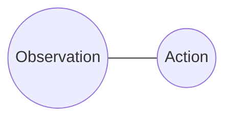
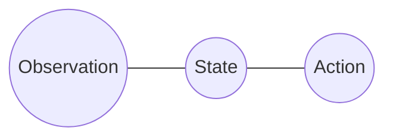

The remarkable thing about statistical mechanics is that it starts with a physical description of the world in terms of an [intractably large](https://en.wikipedia.org/wiki/Avogadro_constant) collection of particles, and ends up with an *effective* theory of some small set of variables: thermodynamics.

It's not uncommon for people to have a hunch that there is some insight here about levels of abstraction that could be relevant to other sciences (particularly neuroscience, economics or cognitive science), but doing this correctly is not straightforward.

What follows is a (very high level) overview of how (equilibrium) statistical mechanics works, and some opinions about what it elucidates re. cognition.

In a [well-known paper](https://bayes.wustl.edu/etj/articles/theory.1.pdf), E.T. Jaynes argued for the viewpoint (subsequently developed very clearly in Ariel Caticha's [book](https://www.arielcaticha.com/my-book-entropic-physics)) that statistical mechanics is an application of general purpose Bayesian principles to otherwise non-probabilistic physics[^1]. This is a natural perspective to take in this context.

[^1]: This isn't the way statistical physics is typically presented in textbooks, partly for historical reasons and partly because people often raise conceptual objections (again see Caticha's book for discussion).

## Going from low level (microstate) to high level (macrostate)

The details of the Bayesian approach to statistical mechanics are subtle, and the Caticha book takes care to get things right. I instead opt to be handwavy.

### What is a physical system

A physical system (let's suppose we're dealing with classical physics, but the same sort of analysis applies in a quantum setting) is characterized at a given time by the positions and momenta of a set of $n$ particles. Imagine atoms moving around in a box, for example. 

So, the state of the system at a given time is a vector of length $6n$ (6 for the 3 coordinates (x,y,z) of position and 3 coordinates of momentum). Call this the *microstate* of the system.

### Where is the uncertainty

For a real system, like a gas in a box, $n$ is enormous - on the order of $10^{23}$. Moreover, we certainly can't measure the positions or momenta of individual atoms. So we are in a state of incomplete information.

The Bayesian attitude - and this is not special to physics - is that when faced with incomplete information, it is rational to characterize our uncertainty by a distribution, which we can then use to calculate expectations. In the present case, this would be a distribution over microstates, i.e. over vectors of length $6n$. 

### How to obtain the distribution

Jaynes' view is that we obtain the distribution (which in Bayesian terms is what you'd call a prior) by **choosing the most entropic distribution that satisfies known constraints**. (As a sidenote, one can derive Bayes' rule as a corollary to this principle of maximum entropy.)

The problem domain in question supplies the constraints. What are these in the case of physics?

### What are the constraints that physics gives us

First, it gives us the state space. Second, we know that energy doesn't change over time (in a closed system). Energy, $H(s)$, which is a real-valued function that is determined entirely by the state $s$, can be measured, so let's say we know it has (up to noisy measurement) a fixed value $H_1$. 

Third, we want a distribution that doesn't change over time (at least, this is the assumption behind *equilibrium* statistical mechanic).

It's then not hard to show that the most entropic distribution is a uniform distribution over all states $s$ which have energy $H(s) = H_1$. This distribution is known to physicists by the silly name of the *Microcanonical ensemble*. It is typically presented in a frequentist way as a collection of "copies" of the system, whatever this means, not as a description of uncertainty.

**Note**: I am sweeping over subtleties to do with entropy in continuous spaces, measures and Liouville's theorem. See Caticha's book for the importance of the incompressibility of phase space.

If what one knows is not a fixed energy $H_1$ but the expectation of $H(s)$ under the distribution, i.e. $H_2 := \int p(s)H(s)ds$, then the most entropic distribution takes the form:

$$
p(s) \propto e^{-\beta H(s)}
$$

where $\beta$ depends on $H_2$. This is known as the *Canonical ensemble*, and in machine learning as the Boltzmann distribution.

## Thermodynamics

A *macrostate* is a distribution over microstates. You should imagine these macrostates as living in a different space to microstates: the space where each point in the space is itself a whole distribution over microstates. Call this macrospace (my coinage).

We can also consider the subspace of macrospace where distributions are of the form of canonical ensembles, i.e. $p(s) \propto e^{-\beta H(s)}$. Call this the equilibrium macrospace. Points (i.e. canonical distributions) in equilibrium macrospace are determined by the (expected) energy or alternatively by $\beta$ (as well as by a small number of other parameters like volume of the system, which I haven't mentioned). 

Thermodynamics is the study of (equilibrium) macrospace. It turns out that properties of the macrospace obtained from reasonably simple physical models of e.g. a crystal, correspond to experimentally measurable quantities. For example, heat capacity (in the experimental sense of the amount of heat needed to change temperature ) is the derivative of expected energy with respect to the reciprocal of $\beta$.

## What is specific here to statistical physics

It's useful to separate out the parts of this story which are general to other domains from the ones which are very specific to equilibrium statistical mechanics.

**(1))**, the macrospace of equilibrium statistical mechanics is a low-dimensional manifold: a point in macrospace is determined by $\beta$ and $V$, the (expected) volume of the system (and maybe a small set of other parameters, depending on the setting)[^2]. This low-dimensional setting is entirely specific to the setting of equilibrium statistical mechanics.

[^2]: Alternatively a point could be determined by say $(H_2, V)$. This is just a different choice of coordinates on the manifold.

**(2)**, objectivity. The macrostate depends on the information a given agent has, so is *observer dependent*. In the context of statistical mechanics however, every agent has essentially the same information, since data about the positions of atoms is not available. Moreover, the distribution is very peaked and all microstates in the typical set of the macrostate give rise to essentially the same experimental predictions. This "effective objectivity" is specific to the setting of equilibrium statistical mechanics.

**(3)**, for various simple physical systems (a physical system here means a choice of microspace and energy function $H$), the distribution is actually analytically calculable. (For example, the canonical ensemble of a harmonic oscillator is just a Gaussian distribution.) This too is entirely specific to the setting of equilibrium statistical mechanics.

**(4)**, the parameters of the macrostate, $(\beta, V)$ bear a very complicated relationship to the parameters of the microstate (the positions and momenta of the particles). It's not like the microstate is also a pair of two numbers, for which $\beta$ is the mean of one, and $V$ the mean of the other. Relatedly, you only get a distribution from the pair $(\beta, V)$ together, not one distribution from $\beta$ and one from $V$. This point is **not** specific to statistical mechanics.

**(5)**, macrostate variables like $\beta$ are not microstate variables. It would be a mistake to think that we're inferring the "true" value of $\beta$ or of the entropy based on our incomplete knowledge of the system. Rather, $\beta$ (along with $V$, etc), represents our uncertainty. Again, this point is not specific to statistical mechanics. On this note, Jaynes' coins the *mind projection fallacy* to describe the mistake of viewing a property of a belief state as a property of the real world, like viewing the randomness of a toin coss as a property of the world rather than of an agent's information. 

## Generalizing beyond physics

Among the benefits of this Bayesian framing of the problem is a natural generalization beyond physics.

### A Bayesian view of cognition

The obvious way to model the cognition of a person (or animal) at a computational level of description is as a Bayesian agent, constantly receiving observations (sensory data) and producing actions (e.g. muscle movements). Viewed in this way, an agent is a distribution $p(o,a)$ ($o$ for observation, $a$ for action), or rather the conditional distribution $p(a|o)$ this joint distribution implies. (Taking time into account properly, $o$ and $a$ should be time varying, and $a$ at time $t$ should depend on $o$ at all previous times. I gloss over this, but over course it is an important detail). Graphically:

This distribution naturally factors as:

That is, an agent's actions depend on observations, but only insofar as the observations inform the agent about the state of the world. If you already knew the exact state of the world (at a given time), no further sensory data would change your actions.

This factorization is the driving idea of symbolic AI. In linguistics, for example, it is imagined that a human decodes an acoustic signal (e.g. the signal corresponding to "Where is the train station?") into semantic information (via a series of intermediate layers: phonology, syntax, etc) and then uses this information to produce an action (e.g. answering the question with "Around the corner"). For vision, one imagines that an agent uses visual data to construct something like a scene graph, which serves as a proxy for the state of the world, and uses that to do things like catching a ball.

### Macrostates and microstates

The physical distinction between macrostate and microstate is useful in the context of Bayesian agents.

The factorizing variable which is called the `State` above really has to be the microstate, i.e. the physical state of the world. Of course, no agent will ever recover this from data, but nor do they have to; the point is only that this is the factorizing variable: *if* they knew it, observations would not change their beliefs (at a given time).

The macrostate on the other hand is the agent's belief state, which like the microstate, varies over time.

By the way, statistical mechanics is really a special case of the above picture, where the action is to calculate some expectation (e.g. the expected energy), the observation is nothing (in statistical mechanics, we only use a prior), the state is the microstate, the belief state is the canonical ensemble, and the agent is the scientist.

## An interesting idea

In the case of statistical physics, intuitive physical variables like temperature (which is $1/\beta$), entropy change, energy, heat capacity and so on turn out to be properties of the macrostate, not the microstate.

What you might then wonder is whether the rich ontology that makes up the world as we encounter it (e.g. physical objects like tables, trees, animals, concepts like particular historical events, fashion styles, etc etc) should actually be understood as "living" in the macrospace, i.e. the space of belief distributions that we obtain from our incomplete knowledge of the microstate of the world, rather than in the microspace per se.

For example, stepping into Washington square park, you will see various buildings, a waterfall, will hear jazz, see stands selling art, etc. In short, there is a "scene graph" containing a range of concrete and abstract objects, with various properties, related to each other in various ways. The idea is that all of these things jointly describe my macrostate, rather than the world's microstate. I'll use "scene graph" to describe this kind of structured description of an entire macrostate, for lack of a better term.

### Points (1)-(5)

If this view of the world is right, what would points (1)-(5) imply?

Re. (1) and (3), the belief state of a complicated agent (like a person) need be neither a low dimensional manifold as in statistical mechanics nor remotely calculable analytically. So it's not immediately impossible that all the very rich structure of the world as we encounter it could be in the macrospace.

Re. (4), the point of note is that the objects in a scene graph describing the macrostate are not themselves necessarily descriptions of parts of the microstate. So it isn't as if an object in the scene graph like the jazz band in the park corresponds to a spatially (and temporally) local collection of atoms in the microstate. The Ship of Theseus thought experiment could be understood broadly as about this point: you shouldn't consider a concept in the world like a ship too literally as a bunch of atoms.
   
Re (2), data matters in this setting unlike in statistical mechanics, so that macrostates - belief states - are deeply dependent on what the agent experiences. This means that the structure of one agent's macrospace need not be the same as another's; my concept of what a cat is might not align with yours. But while agents do not receive exactly the same data, they receive data that is distributed in similar ways, so one might expect that their macrospaces are similar in some sense. 

As for (5), what would a confusion of microstate and macrostate look like? Certainly, if a scene graph is a description of a macrostate, it is a category error to model an agent as performing inference to obtain a distribution over scene graphs - each scene graph is itself a description of an agent's belief distribution. One of my misgivings about symbolic AI, especially in its early incarnations, is that it often assumes that certain objects (scene graphs, phonological structure, plans, algorithms, concepts) are (proxies for) a microstate, and tries to infer (or worse, deterministically obtain them) from input data. But if they actually live in the macrostate, this commits something like the mind projection fallacy. For instance, I don't think that it is obvious that a syntactic and phonological description of a sentence is really a description of an acoustic signal, so much as a description of a *part* of an agent's belief state after hearing that signal.

<!-- 
Note that the possible belief states of an agent (i.e. the macrospace) need not be anything like what is encountered in equilibrium statistical mechanics; for one thing, the information and constraints are totally different. An agent has on-going  -->

<!-- , or derivatives of them. And the physical quantity of entropy (one can measure changes in entropy) is of course the same (up to units) as the information entropy of the distribution. This is (partly) what makes it possible to connect experimental measurements of macroscopic systems (i.e. with a huge number of particles) to theoretical predictions; for simple physical systems like a harmonic oscillator or an ideal gas, one can actually write an analytic solution for $p(s)$ and then derive heat capacity etc by taking derivatives. -->

<!-- one therefore really can write code that says things like "animate objects respawn when killed"

In nature, the only really fundamental properties are physical laws; you don't have laws like "animate objects respawn". 
   There are laws like the Pauli exclusion principle (no two fermions in the same state), but no laws like "

 -->

  
  
  
  
  