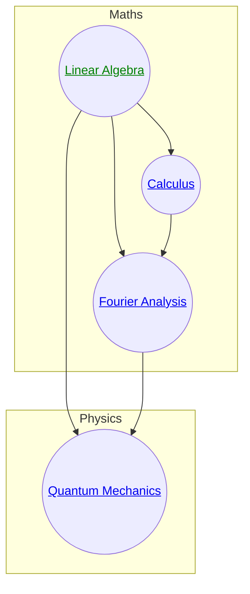
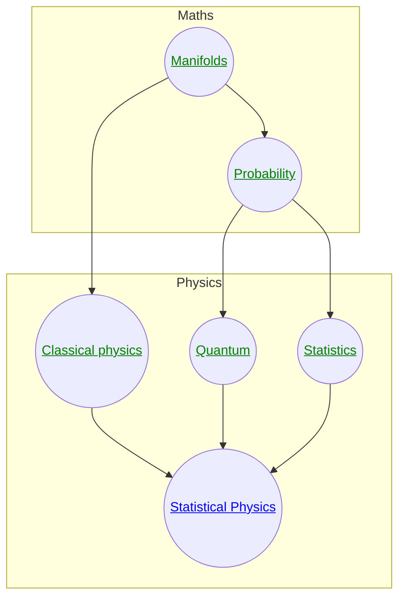

If you write a piece of code and a user can't understand it, it's your fault. If you write a maths textbook and a reader can't understand it, they are told they need to work harder.

The design of these notes is based on the idea that the culture of software engineering, when it comes to versioning, open source, modularity, abstraction and collaboration, would improve maths and physics textbooks[^1].

[^1]: One can take this analogy seriously; a formalization of mathematics is literally a [code library](https://leanprover-community.github.io/mathlib4_docs/Mathlib/FieldTheory/Finite/Basic.html).

Here are some relevant principles of software design:

- **modularity**: a piece of code that does something very complex should be written as the composition of simpler parts, and these parts should be cleanly separated.
- **duplication**: if similar code appears in many places, it should be abstracted into a single piece of code. This is both more robust to changes and makes the hidden similarity explicit.
- **imports**: don't redefine something from scratch if you can import it from a reliable source instead.
- **user focused**: if the code is hard to read, that is a failure of the writer, not the reader
- **declarative style**: it's hard to read source code, but easy to read a high level language like Python.
- **collaboration**: a complex codebase is typically written by multiple people
- **linearity**: you rarely read a codebase in a linear order, from start to finish.
<!-- - **open source**: the code should be publicly available, free and easy to inspect. -->
<!-- - **documentation**: writing concise, clear documentation is a design problem in and of itself -->

And here are examples of how these principles fail to apply to many resources for learning maths and physics:

- **modularity**: In textbooks, the mathematical ideas are often mixed in with the physical ones in a way which makes it hard for a learner to figure out which is which.
- **duplication**: statistical mechanics and Bayesian probability share a lot of their mathematics and concepts, but these resemblances are rarely stated clearly and simply.
- **imports**: quantum physics textbooks often try to teach linear algebra, PDE techniques or Fourier transforms, and do so poorly, instead of deferring it to a better resource.
- **user focused**: suffering on the part of the reader is often seen as a necessary evil, or even just a virtue, not a failure of the text. Decoding the writer's meaning is seen as the job of the reader.
- **declarative style**: derivations in physics textbooks often lose the forest for the trees: it's easy to lose track of the logic of the argument, rather like reading compiled code.
- **collaboration**: textbooks are typically written by one or two people, even though a really adequate resource would require hundreds or thousands of collaborators
- **linearity**: textbooks are often designed to be read linearly, but the subjects they are about don't have this structure
<!-- - **open source**: the code should be publicly available, free and easy to inspect. -->

In software engineering, a culture of discipline around design exists out of necessity; codebases that are not modular become unmaintainable, and likewise for codebases that collaborators cannot understand quickly.

The design choices of these notes try to address some of these complaints. For example, the dependency structure of the resource is very explicit. If you look at the graph above, you can see exactly which pages you must understand in order to understand which others. 

This helps avoid linearity; the reader can learn the basics of all subjects before getting into the harder details of any. 

Because the "code" is open source, anyone is welcome to contribute.

Finally, there is an emphasis on "code reuse". Whenever possible, a new concept is explained in terms of more fundamental ones, rather than starting from nothing. This is why (elementary) concepts from category theory appear here and there, for example, because they are valuable in unifying complex mathematical ideas.

## Example: quantum mechanics

As an example of these ideas in practice, take the presentation of quantum mechanics, Fourier transforms and linear algebra. The approach taken here is to organize the material like this:

The notes on linear algebra are responsible for introducing the spectral theorem (eigendecomposition of self-adjoint operators). 

The notes on Fourier analysis then present the Fourier transform as an instance of such an eigendecomposition, which explains it in terms of recognizable concepts (a unitary operator) in a new context (an infinite dimensional vector space), rather than a new idea entirely. The idea that differentiation is an operator requires a knowledge of calculus, so this is also a dependency. 

Theorems like Parseval's theorem or Plancherel's theorem can then be presented as facts about the unitarity of the Fourier transform, rather than new unfamiliar equations.

The notes on quantum mechanics can then introduce the idea that states of known momentum are eigenstates of a self-adjoint operator without needing to spend time on the maths - that work has been done elsewhere.

## Second example: statistical physics

Here, all the purely mathematical notions of distributions, entropy, expectations, variance and so on are put in the notes on probability. Statistics, by contrast, is about the application of these tools to uncertainty in the world, so fits in the remit of physics (or perhaps more generally should be under "applications").

The notes on statistical physics then don't spend any time justifying the idea that a maximum-entropy distribution should represent uncertainty, but instead focus on the particulars of the physics, namely what constraints are known and how physical notions of temperature, entropy and so on are recovered.

In addition, the language of differential forms, which is important for thermodynamics, and the idea that distributions are points on a manifold, are already introduced, in the notes on differential geometry.