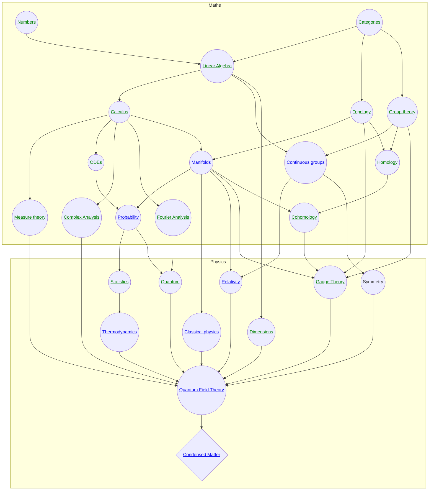

These are my maths and physics notes. 

!!! Caveat

    These notes are all written by me - you therefore shouldn't assume they are either reliable or comprehensive.

!!! Notation

    While I mostly use notation that is standard in maths and physics, I do make use of some computer science notation in places where I feel it is useful. See [here](cs/notation.md) for a glossary.

## stuff 

### FAQ

#### There's an error - can I fix it?

Yes, please let me know, I'm sure there are many errors. Or fix it yourself if you prefer - that's even better. You'll see an edit button on the top right of each page.

#### Why did you structure the notes in these way?

[See here for more information](design.md)

#### What material is included

In general, I try to be sparse, given only the bare bones. For example, I state the spectral theorem in the notes on linear algebra, but not the proof.

The idea is to give a "map" of each subject, and cover the core ideas.

The material should be roughly what a smart undergrad should know about physics and mathematics before grad school.

#### Why did you write these notes

Partly to help myself learn and for my own reference. Partly to experiment with ideas for how to present technical material more effectively.