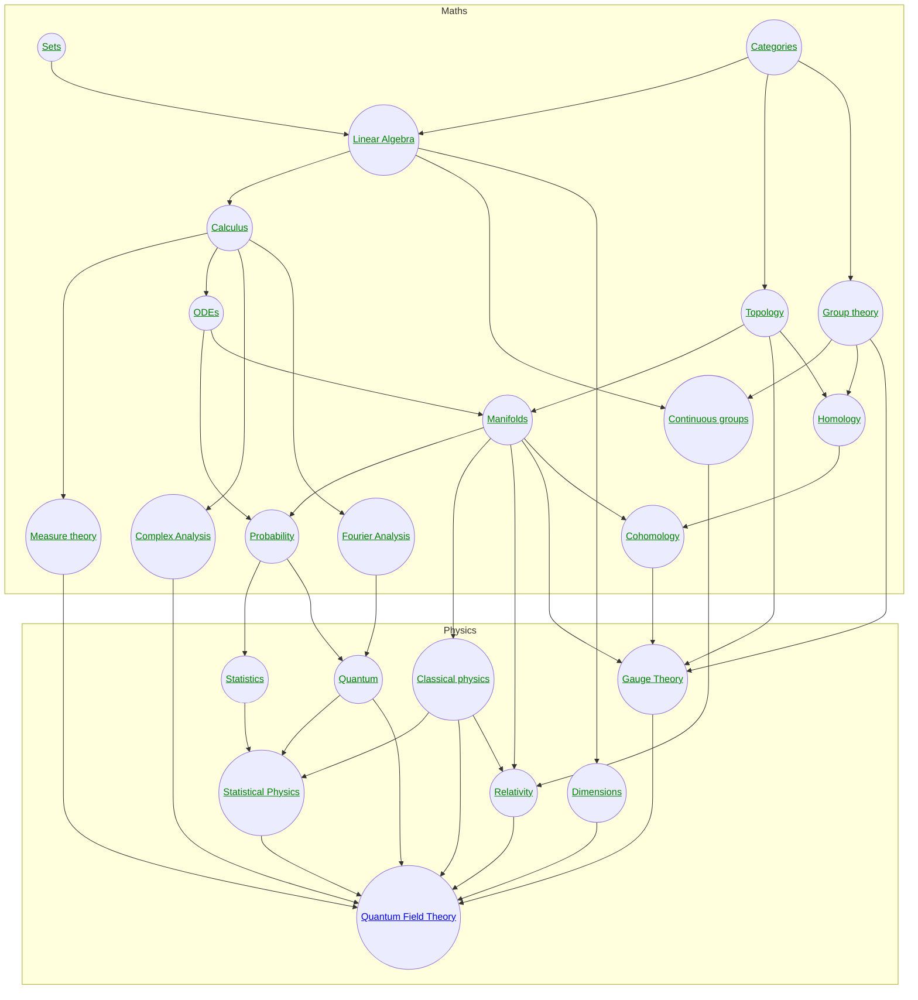

These are my maths and physics notes. 

<!-- 
QFT CMT{<a href='/physics/condensedmatter'>Condensed Matter</a>} 
-->

!!! Caveat

    These notes are all written by me - you therefore shouldn't assume they are either reliable or comprehensive.

!!! Notation

    While I mostly use notation that is standard in maths and physics, I do make use of some computer science notation in places where I feel it is useful. See [here](cs/notation.md) for a glossary.

### FAQ

#### Why did you structure the notes in these way?

[See here for more information](design.md)

#### What material is included?

In general, I try to be sparse, given only the bare bones. For example, I state the spectral theorem in the notes on linear algebra, but not the proof.

The idea is to give a "map" of each subject, and cover the core ideas.

The level of the material should be roughly what a smart undergraduate would know about physics and mathematics before grad school.

#### Is the material standard?

Mostly, but it is opinionated. A good example are the notes on [statistical physics](physics/statisticalphysics.md), which are presented from the perspective of Bayesian probability, information theory and geometry. Here the difference to the standard language is [laid out in a table](physics/statisticalphysics.md##terminology-physics-vs-probability).

When it is possible to make connections between different fields that simplify ideas or reduce the need to repeat material, I do.

#### What order should these notes be read in?

This is indicated by the graph above. For example, the notes on [statistical physics](physics/statisticalphysics.md) assume as given all the material in the notes on statistics, quantum and classical physics, and their respective dependencies.

#### There's an error - can I fix it?

Yes, please let me know, I'm sure there are many errors. Or fix it yourself if you prefer - that's even better. You'll see an edit button on the top right of each page.

#### Why did you write these notes?

Partly to help myself learn and for my own reference. Partly to experiment with ideas for how to present technical material more effectively.

#### Use of AI tools

Pretty minimal, but I write these notes in VSCode, so copilot autocomplete sometimes generates Latex for me which I then check.