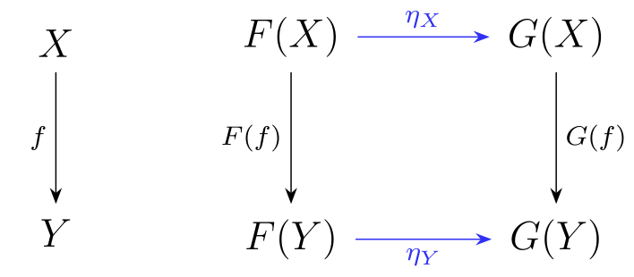

$\newcommand{\R}{\mathbb{R}}$
$\newcommand{\RR}{\mathbb{R}}$
$\newcommand{\C}{\mathbb{C}}$
$\newcommand{\N}{\mathbb{N}}$
$\newcommand{\Z}{\mathbb{Z}}$

Modern mathematics has two central ways of abstracting patterns. 

The first (**idea 1**) is to generalize a particular object into its essential structure. For example, one can take 3D Euclidean space and generalize, to get a more abstract notion of a space in which weighted sums are meaningful, namely a [vector space](linearalgebra.md).

The second (**idea 2**) is to study stuctures by studying their relationships. For example, one can focus on linear maps, which are the structure preserving maps between vector spaces, rather than vector spaces themselves. In this case, the structure is the notion of a weighted sum, so a linear map must preserve them, as in $f(aX+bY) = af(X)+bf(Y)$.

Category theory is the combination of these two ideas; a category is itself a kind of abstract object in the spirit of **idea 1**, not unlike a vector space, but the thing it abstracts is Euclidean space; instead, it abstracts **idea 2**, the notion of relationships between objects. 

And continuing in this vein, one studies a particular category by looking at its relationship to other categories.

Important examples:

- the category FVECT consists of all possible (finite) vector spaces, and the linear maps between them.
- the category SET consists of sets and functions between them
- the category TOP consists of topological spaces and continuous maps
- the category MAN consists of manifolds and smooth maps

## The general notion of a category

A category is a set of objects ($A$, $B$...), and a set of maps (also known as arrows, or morphisms) from one object to another ($f: A\to A$, $g : A \to B$...), with a defined notion of composition, as in $g \circ f$, and an identity map $id : X \to X$ for each object $X$. These follow obvious rules (see any standard reference).

The value of doing this is that many ideas, like products and unions, can be defined in a general category, and relationships between complex ideas become much clearer at this level of abstraction.

## Products

For instance, you can define a product in a category-agnostic way (although a product may not exist in a given category) as an object $P\times Q$ along with two maps $\pi_1 : P\times Q \to P$ and $\pi_2 : P\times Q \to Q$, with the **universal property** that for any other such object $R$ with two such maps $\psi_i$, there is a *unique* map $\gamma$ such that $\psi_i = \pi_i \circ \gamma$. 

## Limits

This definition of a product is a special case of a categorical *limit*, which is an object and some maps out of it that has a universal property like the one above. The details can be made precise easily, see [wikipedia](https://en.wikipedia.org/wiki/Limit_(category_theory)).

## Isomorphisms

$f : A \to B$ is an isomorphism (iso) if it has an inverse $g$, in the sense that $f \circ g$ and $g \circ f$ are the identity on their respective domains.

Bijections are isos in SET. Homeomorphisms are isos in TOP. Diffeomorphisms similarly in a category of manifolds.

One can define categorical notions corresponding to injective and surjective functions too (see e.g. wikipedia).

## Free objects 

**Under construction**

## Duality

Every category has a dual, where all the maps have their direction reversed. Constructions like the product can be realized in the dual category, in which case it is known as the coproduct. Similarly for all colimits. Categorical sums, for instance, are coproducts.

## Monoidal product

There is a second notion of a product, which is a map $(C, C) \to C$, i.e. which takes two objects in a category $C$ and returns a new object of $C$, satisfying some sensible laws (units, composition, etc) up to isomorphism.

In SET, the monoidal product, and the Cartesian product (the one discussed above) coincide, but this is not the case in FVECT, where the monoidal product is the tensor product. This in the fundamental reason why entanglement in quantum mechanics is counterintuitive: it is a non-Cartesian product.

## 2-categories

Having defined various categories, we can then study the relationships between them (as per **idea 2**). This is the category CAT, consisting of all categories, and the structure preserving maps between them[^1].

[^1]: There are details to do with set theoretic concerns about size that are being elided here.

These maps are called functors. They must preserve the relevant structure, which for a category, is the notion of composition and identity. So e.g. $F(f\circ g)=F(f)\circ F(g)$.

CAT has more structure than most categories, since we can also define a notion of a *natural transformation* $\eta : F \to G$, where $F : A \to B$ and $G : A \to B$ are maps in the category, namely functors. This is defined as a family of maps $\alpha_X$ for each object in $X \in A$, such that $\eta_Y \circ F(f) = G(f) \circ \eta_Y$. In category theory, it is typical to represent this equation by a diagram, shown below on the right:

Abstracting, as per **idea 1**, we say that CAT is a 2-category. 

2-categories have one other important kind of construction that 1-categories do not, known as an adjuction. Given 1-maps $f : X \to Y$ and $g : Y \to X$, if we have 2-maps $id_X \to g\circ f$ and $f\circ g \to id_Y$, we say that $f$ and $g$ are adjoint. 

An adjoint functor is one of the two maps in an adjunction in the 2-category CAT. Right (left) adjoint functors preserve (co)limits. In fact, limits can be defined via adjoint functors.

## Diagrams

As well as commuting diagrams like the above, category theory is particularly well suited to pictorial reasoning. See e.g. https://arxiv.org/abs/2307.08891

