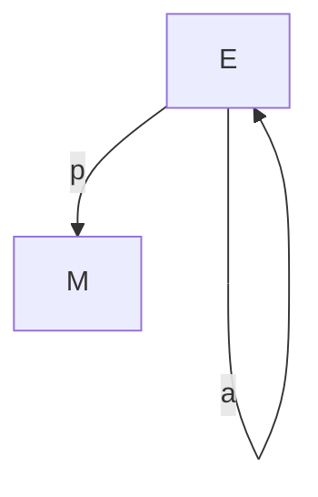

$\newcommand{\R}{\mathbb{R}}$
$\newcommand{\RR}{\mathbb{R}}$
$\newcommand{\C}{\mathbb{C}}$
$\newcommand{\N}{\mathbb{N}}$
$\newcommand{\pd}[2]{\frac{\partial #1}{\partial #2}}$
$\newcommand{\Z}{\mathbb{Z}}$

## Differentiable Manifolds

These are manifolds where the transitions between different local isomorphisms to $\R^n$ are differentiable. The consequence, once we spell out the details, is that we can talk about a fiber bundle, where the base space is the manifold, and to every point $p$ on the manifold, we associate a vector space (the fiber) $T_p(\mathcal{M})$, where $T_p(\mathcal{M})$ is of the same dimension $d$ as the manifold, and therefore isomorphic to $\mathbb{R}^d$. Conceptually, it is the space of tangent vectors. ($T^*_p\mathcal{M}$ is the cotangent space.)

??? Addenda 

    We can (and do) also associate basis elements of $T_p(\mathcal{M})$ with differential operators of type $(\mathbb{R} \to \mathbb{R}) \to (\mathbb{R} \to \mathbb{R})$, which take the derivative of a function, and at a point give a real number that we should think of as the velocity of the path $f$ at $p$.

The whole fiber bundle is the space $TM$, whose points are pairs $p \in \mathcal{M}$ and $q \in T_p\mathcal{M}$. It is *itself* a manifold.

<!-- ??? Orientability

    $|dx/dy| > 0$ for all overlapping charts means orientable -->

			

## Differential forms

We want an object which is dual to a manifold, in the sense that it can take a manifold and produce a number. A **differential form** does this, in the sense that we can integrate a differential form over a manifold to produce a number.

Given a vector space $K$, let $\Lambda_n(K)$ be the space of n-linear antisymmetric maps on $K$. A differential n-form is then a function of type $(p : \mathcal{M}) \to \Lambda_n(T_p\mathcal{M})$. It is an object which can be integrated over an n-dimensional manifold.

$n \leq m$, where $m$ is the dimension of the manifold. Forms of the maximum dimension $n=m$ are called top-forms.

## The category of manifolds

Manifolds form a category $\mathcal{M}$, with the maps being smooth functions between manifolds. Differential forms form a category too, given by a contravariant functor $F^k$ on the category of manifolds which takes a manifold $M$ to $\Omega^{k}(M)$, and acts on maps as follows:

$$ F^kf\omega(H_1,\ldots,H_k) = \omega(df(H_1),\ldots,df(H_k)) $$

<!-- Having a morphism $f$ between manifolds $M\to N$ gives us a natural definition of a morphism $f^{*}: \Omega^{k}(N) \to \Omega^{k}(M)$. Concretely: -->

The image of a smooth map $f \in \mathcal{M}$, namely $F^kf$, is called the pullback, or rather, $f^*\omega =: F^kf(\omega)$ is called the pullback of $\omega$ along $f$.

Forms are invariant with respect to integration, under the pullback, in the following sense:

$$ \int_{\phi(M)}\alpha = \int_{M} \phi^*\alpha $$

This means we can calculate integrals on an $n$-manifold $M$ by pulling back along a map $\mathbb{R}^n \to M$, and thus reducing the problem to one of integration on $\mathbb{R}^n$, which can be done by e.g. Riemann integration.

For $F^k$ and $F^{k+1}$, there is a natural transformation $F^k \to F^{k+1}$ known as the exterior derivative $d$, to be defined concretely below. More precisely, the components of the natural transformation, which take $k$-forms to $(k+1)$-forms are called $d$. Being maps in a category of vector spaces, linearity is clearly obeyed, and we'll see a form of the product rule. Further, the naturality condition implies the commutativity of the exterior derivative and pullback ($d\circ \phi^* = \phi^* \circ d$).

There is also a map from $k$-manifolds to $(k-1)$-manifolds, by mapping a manifold to its boundary. This operator is called $\partial$. Note that $\partial \circ \partial = \{\}$. Boundaries have no boundary.

The culmination of all of this is **Stokes' theorem**, which establishes a relationship between $\partial$ and $d$:

$$ \int_{\partial M} \alpha = \int_{M} d\alpha $$

This immediately implies that $d^2 = 0$. The fundamental theorem of calculus is a special case of Stokes' theorem.

## Vector fields

These are sections of the bundle. That is, a function of type:

$$
f : (p : \mathcal{M}) \to T_p\mathcal{M}
$$

??? Note

    Note that the type of a vector field is a [dependent](https://en.wikipedia.org/wiki/Dependent_type) product type. This means that the **type** of the output of the function, namely $T_p\mathcal{M}$ depends on the **value** of the input $p$. The type of a tangent bundle is a dependent sum type.

## Differential Geometry on Fiber Bundles

[Fiber bundles](topology.md) are manifolds, and therefore a space in which differential geometry can be explored. In fact, they are fundamental to modern physics (in particular [gauge theories](../physics/gaugetheory.md), which include the Standard Model and general [relativity](../physics/relativity.md)).

### Principal bundles

For a group $G$, a principal g-bundle is a bundle $E \to M$ with a free right action $a$ (i.e. for $e\in E, e(a(g))=e$ iff $g=1$) which is isomorphic (in the category of bundles) to $E \to E/G$.

One can consider maps between sections of a principal g-bundle, with $\exists g, \sigma(x) = \sigma_2(x)a(g(x))$, by precisely the freeness.

<!-- If one has a group acting on the fiber space $F$, we say that it's a structure group for the bundle when $\Phi_{ab}(x, y) = (x, \phi_{ab} : (U_a \times U_b \to G )(x)(y))$, where $\phi_{ab}$ is the data we need to provide. -->

### Classifying bundles

The *characteristic class* of a bundle is an invariant which can identify if the bundle is non-trivial.

Considering $b$ as the functor that maps from TOP to SET, with $b(X)$ being the set of fiber bundles over $X$ (up to isomorphism), a characteristic class $c$ is a natural transformation $b \to H^*$, i.e. from the functor $b$ to the cohomology functor. Concretely, it is a map $c$ that takes g-bundles to elements of $H^*$, the union of the cohomology spaces, with the naturality condition $c(f^*P) = f^*(cP)$.

That means that for any bundle over a manifold $X$, we have a differential $k$-form (up to an exact form), which is only exact (i.e. $0 + df$) for the trivial bundle.

There is a variety of different characteristic classes. These can typically be calculated explicitly in terms of a [connection](differential_geometry.md) (although they don't depend on that connection), which is why they are useful.

## Connections, parallel transport and covariant derivatives

There is a crucial piece of information absent from the definition of a fiber bundle, namely a way to lift a path on the base manifold $B$ to a path on the whole space $E$ (such that the path on $E$ can be pushed down onto $B$ by the bundle projection to recover the original path on $B$). This is known as parallel transport. 

We call such an object a *connection*; from the physical perspective, and it determines parallel transport. It is useful to have in mind the example of a line bundle on a 1D manifold, where above each point on the base manifold, there is a line. Then, a path through the whole manifold is a path in 2D space, which can be projected down onto the base. Moreover, a tangent vector on the full space separates into a vertical space and a horizontal part (in a coordinate dependent way); that is, the part that projects onto the base, and the other part.

The natural way to specify a connection is by a Lie algebra valued 1-form on a bundle. That is, for an infinitesimal change on the base manifold, we want a Lie algebra element whose exponential describes the way the fiber changes, since that then characterizes how the whole space changes (recalling that a fiber bundle is locally trivial). We can then integrate to obtain parallel transport.

!!! Note

    Connections, parallel transport, and covariant derivative are all separate notions, but from a physical perspective, all tend to occur together, so get conflated.

For instance, given a **vector** bundle (i.e. a fiber bundle whose fibers are vector spaces) with base space $B$ and fiber $F$, a connection is a function $A : (p : B) \to TM_p \to (F_p \to F_p)$. This is precisely the data you need to define an ODE on $\phi : [0, T] \to F$, with $\gamma : [0,T] \to B$, namely:

$$
\frac{d}{dt}\phi(t) = A(\gamma(t))(\gamma'(t))(\phi(t))
$$
<!-- 
$$
a'_\gamma(t) = A(\gamma'(t)) \cdot  a_\gamma(t) := (R_{a_\gamma(t)})_*A(\gamma'(t))
$$

solved by 

$$
a_\gamma(t) = exp(-\int_0^tA(\gamma'(s))ds)
$$ -->

which, eliding all details, implies a unique $\phi$ such that $G = \gamma \mapsto (\phi(0) \mapsto \phi(T))$ is a functor from the path groupoid of $B$ to some linear category on $F$. This is parallel transport.

!!! Note

    Connections can also be defined on the frame bundle of a vector bundle, which is a principal g-bundle. There are several closely related notions at play.

<!-- ## Parallel transport on a g-bundle

Parallel transport on a g-bundle should respect the bundle, in the sense that the effect of the transport should amount to a change in the fiber supplied by a function $f_\gamma : [0,1] \to G$, i.e. in a local trivialization $\phi$:

$$
\phi(pt^t_\gamma(e : E)) = (\gamma(t), f_\gamma(t)\cdot \phi(e)_2) 
$$ -->

<!-- **Principal connection**

$$(R_g)_*H_pP = H_{p\cdot g}P$$

or equivalently, lifting a path on $M$ to $E$ by starting at $p$ and then mapping by $g$ is the same as lifting to $p\cdot g$ -->

### Covariant derivative in terms of parallel transport

Here we work with a vector bundle.

We want a definition of $\nabla_{\gamma'}s$ that detects when $s(\gamma(t))=pt^t_\gamma(s(\gamma(0)))$, in other words which measures when $s$ of a path on $M$ is the parallel transport on $E$. The following does the trick:

$$
\nabla_{\gamma'}s = \frac{d}{dt}pt^{-t}_\gamma(s(\gamma(t)))
$$

so that when $s(\gamma(t)) = pt^t_\gamma(s(\gamma(0)))$, $\nabla_{\gamma'}s = 0$.

### Alternative perspective on connection

Observe that the space of sections is a vector space, with multiplication by functions.

On a vector space, call an operator that satisfies the Leibniz rule a *derivation*. Then a connection is a map from a vector field to a derivation on sections over the full space of a bundle. Specifically, $D_v(fs) = v(f)s+fD_vs$. Choosing a basis $e_i$ on the section, by linearity, $D_{\partial_\mu}e_i = A_{\mu i}^je_j$. Then:

$$
D_vs = D_{v^\mu\partial_\mu}s = v^\mu(D_{\partial_\mu}s) = v^\mu(D_{\partial_\mu}s^ie_i) \\
= v^\mu((\partial_\mu s^i)e_i + s^iA_{\mu i}^je_j) = v^\mu(\partial_\mu s^i + s^jA_{\mu j}^i)e_i
$$

## Curvature

When a connection is expressed as a form on a principal g-bundle (rather than on the base manifold), as it can be with some care, the curvature $F$ is defined as $F = dA$. Non-Abelian connections accrue extra terms.

**Under construction**

<!-- ## Gauge transformations

todo: what are they

$$
D_{\gamma'(t)}u(t) =: \frac{d}{dt}u(t) + A(\gamma'(t))u(t) = 0
$$

is an ODE for a path $u : \R \to F$ on the fiber $F$. Since $\gamma$ is a path on $M$, we have a lift. -->

## Holonomy

Any loop $\gamma$ on $M$ yields a linear map from the start to the end of the lifted path on the fiber, known as the *holonomy* of the loop, which transforms under a gauge transform like: 

$$
H(\gamma, D') = g(\gamma(T))H(\gamma, D)g(\gamma(0))^{-1}
$$

and in particular, its trace is gauge invariant, by cyclicity.

<!-- ## temp notes

Consider a principal bundle. Now any A in the lie algebra of the group induces a vector field on the bundle, namely:

$$
X^A_pf = \frac{d}{dt}f(a(exp(At))p )|_{t=0}
$$

or $i : Lie Algebra(G) \to \Gamma(TP)$

$V_pP := \ker(\pi_*)$

$X^A_p \in V_p$

Ehresman connection is then a choice of horizontal vector field at each point that is smooth and respects g. It can be given by a one-form $\omega(X_p) = i^{-1}(ver(X))$, where $ver$ is the vertical part of $X$. This is a Lie algebra element

localization: we can pullback $\omega$ along a section, to get something local

aligning sections: by freeness, $\sigma_1 = a(g)\sigma_2$

Aligning the local 1-forms:

FINISH....
$$
\omega(p)^{-1i}_k \partial_\mu\omega(p)^k_jdx^\mu
$$

Recall:
$$
X_{\gamma, p}f := (f \circ \gamma)'(0)
$$ -->

## Bundles are simple spaces

Given an integral (integer values when integrated over 2-loops) closed 2-form F, it may not be exact, **but** there exists a 1-form $A$ on a bundle $P \to P/U(1) \cong M$ such that $\pi^*F = dA$

## Metrics

To be Riemannian, a manifold must have a positive definite two-form $g$ called the metric (since it provides an inner product $\langle v, u \rangle := \sum_j g^{ij}v_ju_i$ ), and notationally we write, for $v^i \in {T_p(\mathcal{M})}$:

$$
v_i := v^jg_{ij}
$$

Crucially, we write $v^iu_i := \sum_i v^iu_i$, but only if one index is superscript and one is subscript. This ensures that we keep track of the difference between vectors and dual vectors, which we convert between using the metric above.

If $x$ are coordinates on our manifold, and $y(x)$ is a diffeomorphism to new coordinates, then

$$
g'_{\mu\nu}(y) = \frac{\partial x^\alpha}{\partial y^\mu}\frac{\partial x^\beta}{\partial y^\nu} g_{\alpha\beta}(x)
$$

!!! Why

	Recall that $dy^\mu = \pd{y^\mu}{x^\alpha}dx^\alpha$. Recall that length $ds^2$ is coordinate invariant. So $g_{\alpha\beta}(x)dx^\alpha dx^\beta = g_{\mu\nu}(y)dy^\mu dy^\nu = g_{\mu\nu}(y) \pd{y^\mu}{x^\alpha}dx^\alpha\pd{y^\nu}{x^\beta}dx^\beta$, which is satisfied by $g_{\mu\nu}(y) = \pd{x_\alpha}{y_\mu}\pd{x_\beta}{y_\nu} g_{\alpha\beta}(x)$.

<!-- ### Derivatives

$$
X^i_{,j} := \frac{\partial x_i}{\partial x_j}
$$

and 

$$
\partial_\mu := \frac{\partial}{\partial \theta^\mu}
$$

Note that this requires that we know that $\mu$ is the index variable associated with coordinates $\theta$.

This notation is consistent with the fact that $\theta_\mu$ should combine with a vector in the tangent space $v^\mu$, not a dual vector $v_\mu$.  -->

<!-- ## Lie bracket and derivative

The Lie bracket of two points in a tangent space is $[X,Y] := X\circ Y - Y\circ X$.

For a top form:

$$
(\mathit{div}_\eta X)η := d(i_X η) = ((d\circ i_X) + (i_X \circ d)) \eta = L_X \eta
$$ -->

## Working with coordinates

$$
\partial_\mu := \frac{\partial}{\partial \theta^\mu}
$$

This is of course coordinate dependent.

### Pushforward of cotangent space

$$
f_*V(g) = V(g\circ f)
$$

or in coordinates:

$$
W^a\frac{\partial}{\partial y^a}(g \circ \psi^{-1}(y)) = V_b\frac{\partial}{\partial x^b}(g\circ f \circ \phi^{-1}(x))
$$

We now choose $g=\psi_a$ (or, not pointfree: $y_a = \psi_a(p)$), so that we obtain:

$$
W^a = V_b \frac{\partial}{\partial x^b}(y_a(\phi^{-1}(x))) := V_b \frac{\partial y^a}{\partial x^b}
$$

So the pushforward is coordinates is matrix multiplication by a Jacobian.

### Divergence in coordinates

$$
\mathit{div}_{a(x)dx^1 \wedge ...\wedge dx^n} X = \frac{1}{a}(aX^i)_{,i}
$$

### Lie derivative in coordinates

$$
\tau^\mu(\delta, \sigma(\epsilon, x)) - \sigma^\mu(\epsilon, \tau(\delta, x)) = \epsilon\delta[X,Y]^\mu
$$
