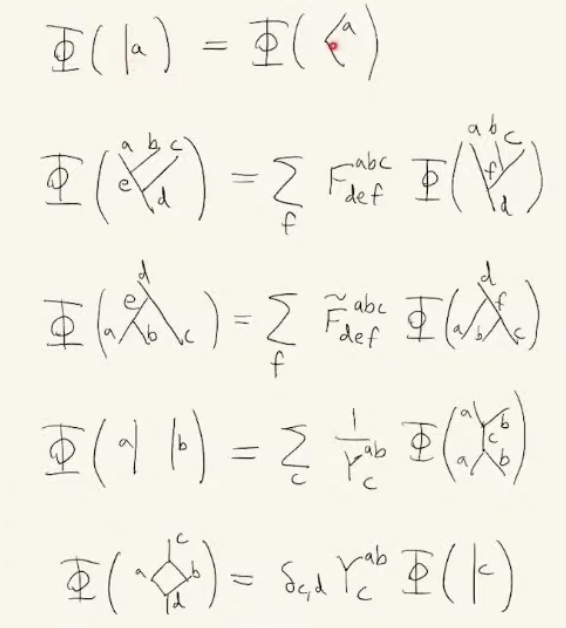

#

from Shankar:

The correlation function of the Ising model in the thermodynamic limit is the ground state expectation value of the green's function (time ordered product) of the operator whose eigenvalue space is the support of the classical variable in question.

# Condensed Matter Physics

This is the application of quantum statistical physics to matter. A typical example would be to study a metal, and understand its different phases, equilibrium properties, symmetries and so on, with the goal of predicting/engineering measurable properties like conductivity.

It is an appealing subject because it is phenomonologically rich (many unpredictable things happen in systems that are simple to describe), these phenomena are actually observed experimentally, and it involves nice physics (quantum field theories, topology, gauge theories, phase transitions, emergence).

## Many body models

It is typical of a variety of condensed matter models to start with a graph (i.e. a simplex with vertices and edges), and associate Hilbert spaces $\mathcal{H}_i$ to all vertices, edges or both, so that configurations live in the tensor product space $\bigotimes_i \mathcal{H}_i$.

For instance, we might have a system in which we have a chain of sites, and each site has states in a qubit Hilbert space.

The transerve quantum Ising system is one example, with Hamiltonian:

$$
-g \sum_{\langle ab\rangle}\sigma_a^z\sigma_b^z - \frac{1}{g}\sum_a \sigma^x_a
$$

This system exemplifies many of the themes of condensed matter theorem - see below.

## Classical - quantum correspondence

Given a classical statistical system in $(d,0)$ dimensions[^1], like the Ising model (with $(2,0)$), we can often obtain a quantum mechanical system in $(d-1, 1)$ dimensions that has the same partition function.

For instance, the transverse quantum Ising system above is the quantum counterpart of the classical 2D Ising model.

[^1]: Understand $(p,q)$ to mean $p$ space dimensions and $q$ time dimensions.

## Duality

Quantum systems often have duals. For example, as explained very clearly [here](http://www.spintwo.net/Courses/Gauge-Theory-Student-Meetings/resources/Z2Ig.pdf), the tranverse quantum Ising model is dual (read: isomorphic) to a $\Z^2$ lattice gauge model, i.e. a system with qubits on edges (of a lattice which we can view as being dual to the original lattice). 

While the transverse Ising model has a global symmetry, the $\Z^2$ gauge model has a local symmetry, i.e. a gauge freedom.

## Statistical mechanics

Sometimes we are interested in the ground state of the system, since this dominates at low temperature. Other times we are interested in the thermodynamic quantities (expectations of the distribution, derivatives of those, etc).

Here is a computation which showcases many of the tools used (path integrals, complex analysis, Fourier transforms, Grassman numbers, coherent states).

Example: Fermi gas

Given a system $H = \sum_k e_k\hat c^\dagger \hat c$, we will calculate the expected number of particles $N = -\frac{\partial F}{\partial \mu}$.

We work with the grand canonical ensemble, so $Tr(e^{-\beta (H + \mu N)})$, so that in path integral form, we have:

$$
\int D[\bar\psi,\psi]e^{-\int_0^\beta d\tau\sum_k\hat\psi_k(\tau)(\partial_\tau + \epsilon_k - \mu)\psi_k(\tau)}
$$

todo

??? Derivation 

todo 

or in frequency space:

$$
S = \beta \sum_{k,n}\bar \psi_{k,n}(-i\omega_n + \xi_k)\psi_{k,n}
$$

So that $Z = \prod_{k,n}\beta(-i\omega_n+\xi_k)$ and $N = T\sum_{k,n}\frac{1}{i\omega_n - \xi_n}$.

We then perform a contour integral to obtain $N = \sum_k\frac{1}{e^{\beta \xi_k}+1}$, as expected.

??? Derivation

todo

## Electronic structure

Here, one views a metal as a crystal of ions, with electrons moving around freely. For reasons to do with renormalization, it turns out that this can be modeled as a gas of fermions.

Since position on a lattice is discrete and periodic, its Fourier transform (momentum) is also discrete and periodic. 

This holds also in 3D, in which case each possible momentum $k$ is a vector in $\R^3$ (with integer coefficients). In this case, since only a single fermion can occupy a given $k$, a system with $N$ fermions at low temperature will be in the ground state, in which case, the occupied states will form a sphere. 

The boundary of this sphere is known as the Fermi surface, and the presence of interactions in real metals alters the shape of the surface, although it typically remains closed.

For a current to exist in response to a voltage, electrons must be able to occupy higher TODO

<!-- # Superconductors

Phenomenologically, superconductivity is a phase of some metals characterized by effects including the expulsion of magnetic fields from the interior of the metal in question (Meissner effect) and a non-decaying current.

Reasonably good models exist for *some* cases of superconductivity, but even there, it's fraught with difficulty. -->

<!-- ## Models

To model it, one can hard-code an attractive force between the fermions of your model, in which case is it not hard to show that the electrons pair into *Cooper pairs*, and that the ground state has $B=0$ (part of the Meissner effect). These bosons Bose-condense in the ground state under the critical temperature. 

The *BCS* theory is a model of how a material might actually give rise to such an effective force. It is only correct for certain classes of superconductors, while for others, the mechanism is unknown. In BCS, the electrons interact with the phonons - in other situations, we often disregard this interaction because electrons are much lighter (Born-Oppenheimer approximation). 

This phonon-electron interaction gives rise to an effective low energy Hamiltonian with an attractive force on Fourier space fermions, 
    which regime
    ??

One can then take a mean field approximation of this Hamiltonian.  -->

------------------

# Summary of magnetism

Start with the tight binding model, including coulomb interaction

at large U, and at half filling (or slightly less), we have hubbard model, where we neglect the exchange term and the non-onsite direct term

we want to explore this in t-U space. 

we analyze this perturbatively, with t/U small:

    we attempt to find a unitary transformation e^iS such that the hamiltonian is block diagonal, with each block a different number of overlaps

    at second order, this gives the extended t-J model

        at half filling, mott insulator, where spin flips are the fundamental excitations

        at low energy and higher sectors, it is ferromagnetic

antiferromagnetic arises with direct term, because of the second order perturbation term being a hop
$$
H_{eff}^{(2)} = V + T_0 + \frac{1}{U}[T^+, T^-]
$$

ferromagmetic arises from exchange interaction being strong

we now consider ferromagnets and antiferromagnets on their own terms

for ferromagnets, groundstate is all parallel, and is the symmetry broken state is the groundstate

we can view the fourier transform of single flip states as the relevant eigevectors, so are the excitations, magnons, which are a goldstone boson, although with a quadratic dispersion relation

the corresponding analysis of the antiferromagnet is a fucking nightmare:

    we take opposite axes for the two sublattices, perform the primakoff-holstein transformation, fourier transform, and then bogoliubov

antiferromagnets can only occur on certain topologies, those which are separable into two distinct sublattices where neighbours of 1 are only neighbours of the other

    ground state is NOT neel state, but rather superposition of all neel states, and spontaneous symmetry breaking is exhibited

we now consider the weak coupling limit (meaning coulomb weak compared to kinetic energy). to do so, we appeal to mean-field theory, and take the state of each site to be independent, with an effective mean field.

## Condensed matter

### Bloch's Theorem

The idea is that given a periodic potential, which is to say a potential symmetric under the representation of a cyclic group of translations, there is a simultaneous basis of $H$ and translations $T_a$, of the form:

$$
\psi_{nk}(r) = e^{ik\cdot r}u(r)
$$

with $u$ periodic. This is obviously an eigenstate of $T_a$; the substantive claim is that there is an eigenbasis of $H$ of this form. These are **not** eigenstates of momentum.

**Physical consequences**

When modeling electrons in a solid, the ions tend to be much more massive than the electrons, so treating them as static, we model them as a periodic potential, and model the whole lattice as an n-torus too.

**Bands** In $\psi_{nk}$, the $n$ index is discrete and corresponds to the *band* while $k$ varies continuously (in the thermodynamic limit) across the Brilloun zone.

We view $\psi_{nk}$ as the wavefunction of an electron. $\hbar k$ is the *crystal momentum*, which is conserved only modulo a lattice vector.

**Proof outline of Bloch's theorem**

A cyclic group on a Hilbert space of functions acts like:

$$
T_a\psi(x) = \psi(x+a)
$$

A cyclic group is Abelian and therefore the irreps are 1D, with:

$$
T_a\phi(x) = 1^{\frac{1}{N}}\phi(x) = e^{i2\pi n/ N}\phi(x)
$$

where $N$ is the order of the group (i.e. the number of translations to get back to where you started.) and $n \in \Z$ up to $N$.

Assuming they commute with the Hamiltonian, the irreps are the eigenspaces of H, so it follows that for eigenfunctions of $H$:

$$
\phi(x+a) = e^{i2\pi n/N}\phi(x)
$$

Since the norm of $\phi$ is therefore invariant under translation, it must have the form:

$$
\phi(x) = e^{iB(x)}u(x)
$$

for $u(x)=u(x+a)$ and $B(x)\in \R$.

### Symmetry

When we talk about symmetries in the quantum context, we usually mean projective representations, in the sense the $\pi(g)|\phi\rangle = e^{ik}|\phi\rangle$ for $k \in \R$.

This is because we are interested in the Hilbert space only up to expectation values $|\langle \pi(g^{-1})\phi |A\pi(g)|\phi\rangle$, and the $e^{ik}$ cancels.

Recalling that we care about expectations, we can also look at the action of $g$ on operators, since $|\langle \pi(g^{-1})\phi |A\pi(g)|\phi\rangle = \langle \phi | B | \phi \rangle$ for $B = \pi(g^{-1})A\pi(g)$, so $B=A$, or equivalently $[A, \pi(g)] = 0, \forall g\in G$ is the condition of symmetry.

### Noether's theorem

From the perspective of a field Lagrangian, a transformation which adds $\delta_s\phi_a(x)$ is a symmetry of the action if $\delta_sL = \delta_\nu K^
\nu$, for $\nu$ a 4-vector index.

Noether's theorem says that such a symmetry implies a current $j^\nu$ with $\partial_\nu j^\nu = 0$. The upshot is that we obtain a global constant by integrating:

$$
0 = \int \partial_\nu j^\nu(x,t)dx = \int \partial_t j^0(x,t)dx + \int \partial_i j^i(x,t)dx
$$

$$
= \partial_\nu\int j^\nu(x,t)dx  + \int j^i(x,t)dS_i
$$

$$
:= Q(t)
$$

with the $\int j^i(x,t)dS_i$ term obtained by Stokes' theorem and typically vanishing at infinity.

**Proof**

A field that satisfies the equations of motion has (Euler-Lagrange equation):

$$
\frac{\partial L}{\partial \phi} - \partial_\nu \frac{\partial L}{\partial(\partial_\nu\phi)} = 0
$$

Therefore, a field which satisfies both a symmetry and the equation of motions has:

$$
\delta_sL = \frac{\partial\mathcal{L}}{\partial \phi}\delta_s\phi + \frac{\partial\mathcal{L}}{\partial (\partial_\nu\phi)}\delta_s(\partial_\nu \phi)
$$

$$
= \frac{\partial\mathcal{L}}{\partial \phi}\delta_s\phi + \frac{\partial\mathcal{L}}{\partial (\partial_\nu\phi)}\partial_\nu (\delta_s \phi)
$$

$$
= \frac{\partial\mathcal{L}}{\partial \phi}\delta_s\phi + \partial_\nu(\frac{\partial\mathcal{L}}{\partial (\partial_\nu\phi)} (\delta_s \phi)) - \partial_\nu\frac{\partial\mathcal{L}}{\partial (\partial_\nu\phi)} (\delta_s \phi)
$$

$$
= (\frac{\partial\mathcal{L}}{\partial \phi} - \partial_\nu\frac{\partial\mathcal{L}}{\partial (\partial_\nu\phi)} )\delta_s\phi + \partial_\nu(\frac{\partial\mathcal{L}}{\partial (\partial_\nu\phi)}\delta_s \phi)
$$

$$
=  \partial_\nu(\frac{\partial\mathcal{L}}{\partial (\partial_\nu\phi)}\delta_s \phi)
$$

So that we have for $j^\nu = \frac{\partial\mathcal{L}}{\partial (\partial_\nu\phi)}\delta_s \phi - K^\nu$:

$$\partial_\nu j^\nu = \partial_\nu(\frac{\partial\mathcal{L}}{\partial (\partial_\nu\phi)}\delta_s \phi) - \partial_\nu K^\nu = \delta_s L - \delta_s L = 0 \\ \square
$$

$j$ is the Noether current.

### Noether in a quantum setting

This is consistent with a quantum setting, as follows:

## Conservation

For unitary $U$ with $U = e^{iQ}$, and $[U,H] = 0$, we have $[Q,e^{iH}] = 0$, so that by the Ehrenfest theorem, the expectation of $Q$, an observable, is time-constant.

## Symmetry breaking

covered in statistcal physics: revise or remove todo

From notes:

> "Spontaneous symmetry breaking (SSB) is the phenomenon in which a stable state of a system (for example the ground state or a thermal equilibrium state) is not symmetric under a symmetry of its Hamiltonian, Lagrangian, or action."

Note that this implicitly invokes statistical mechanics, in the definition of "stable".

For a symmetry $U$ that commutes with $H$, and a non-symmetric state $|\phi\rangle$, we have $U|\phi\rangle \neq |\phi\rangle$ and $\langle H \rangle_{|\phi\rangle} = \langle U^{-1}HU \rangle_{|\phi\rangle} = \langle H \rangle_{U|\phi\rangle}$, so we have a collection of non-symmetric states that share an energy.

We can in general define an *order parameter* $\mathcal{O}$ with eigenvectors being these non-symmetric states, distinct non-zero eigenvalues, and non-zero expectation for symmetric states. For instance, in the case of a crystal, the collective position operator would do as $\mathcal{O}$.

In general, $\mathcal{O}$ won't commute with $H$, so eigenstates of $\mathcal{O}$ won't be eigenstates of $H$. 

Recalling that the equilibrium distribution is a probability distribution over energy eigenstates, this means that in a broken-symmetry state, the system is not in equilibrium.

However, at the thermodynamic limit ($N \to \infty$, $V \to \infty$), things work out as follows.

TODO

## Tensor product orthogonality in crystal

Letting two states be $\otimes_i |\phi_i\rangle$ and $\otimes_i |\psi_i\rangle$, we have $\langle\otimes_i  \phi_i| \otimes_i \psi_i\rangle = \Pi_i \langle \phi_i | \psi_i \rangle$ by definition of the inner product for tensor product spaces. 

But assuming that these states are invariant under a shifting operator, we have $\phi_i = \phi_j$, $\Pi_i \langle \phi_i | \psi_i \rangle = \langle \phi_0 | \psi_0 \rangle^N$, which is clearly either $0$ or $1$ in the limit of large $N$.

## Quotients

Suppose the symmetry of the system is a (projective) representation of a group $G$ on the Hilbert space (i.e. $\pi(g)|\phi\rangle = e^{ik}|\phi\rangle)$ for some $k \in \R$. 

Symmetry breaking states may still have a symmetry described by a subgroup $H \subset G$. For example, the group of continuous shifts in 1D has a discrete shift subgroup that preserves the crystalline states (which are the symmetry breaking states).

If $|\phi\rangle$ is a symmetry-breaking state, then for $g_1, g_2 \in G$,  $g_1|\phi\rangle = g_2|\phi\rangle$ if $g_1 = g_2h$ for $h \in H$. So we consider the quotient group $G/H$; its elements index the distinct broken symmetry states.

> "For continuous groups, the classification of broken symmetry states can also be expressed
in terms of the generators of the continuous symmetry transformations, defined in Eq. (1.5).
In this context, generators Q of which the broken-symmetry state under consideration is an
eigenstate, are called unbroken generators or unbroken Noether charges, and any finite transformation generated by Q is also unbroken. Conversely, generators that do not leave the state
invariant are called broken. The continuous symmetry group may be broken down to either a
continuous or a discrete subgroup, and even to the trivial group."

## Debye and density of states

We often use the measure $d\omega g(\omega)$, with $g(\omega) = 3(\frac{L}{2\pi})^3\frac{4\pi\omega^2}{v_s^3}$ to count normal modes.

For instance, the Debye approximation has $E = \int_0^{\infty} d\omega g(\omega) \langle H(\omega) \rangle$ 

which, expanding, becomes:

$$
E = \int_0^{\infty}d\omega g(\omega) \hbar\omega (\langle n(\omega) \rangle + \frac{1}{2}) = \int_0^{\infty}d\omega g(\omega)  (\frac{\hbar\omega}{e^{\frac{\hbar\omega}{kT}} + 1} + \frac{\hbar\omega}{2})
$$

## BKT

$$
H = \int (\nabla\phi)^2
$$

$$
\int \nabla\phi dl = 2\pi n
$$

so that $\nabla\phi = \frac{n}{r}$ (with $r$ as a polar coordinate).

Then 

$$
E \propto \log \frac{L}{\xi}
$$

where $L$ is the size of the whole lattice and $\xi$ is the lattice spacing (so the upper and lower bounds of the integral).

$$
S = \log (\frac{L}{\xi})^{2}
$$

cf. solution of poisson equation in 2D vs 3D

At low temperature, vortices are bound in pairs, while at high temperature, they are free. There's an analogy to insulating and conducting phases of a metal.

## Topological quantum field theories

!!! References

    For categorical background: see https://arxiv.org/pdf/math/0512103

[Recall](../physics/gaugetheory.md) that field theories can be defined that have no dependence on the metric of spacetime, such as the Chern-Simons Lagrangian. Then if we consider a quantum theory with this Lagrangian, defined via the standard path integral over all connections, we can view the normalization constant (a.k.a. partition function) $Z$ as a function of $M$. We then see that $Z(M)$ is a topological invariant of $M$: it cannot depend on local curvature for example, since that involves the metric.

Now consider a manifold $M$ in 3 dimensions with a pair of boundaries $A$ and $B$. More formally, we provide orientation preserving diffeomorphisms $f_1 : A \to M$ and $f_2 : B \to M$, such that $im(f_1) \cup im(f_2)$ covers $\partial M$. Such an $M$ with this extra data is a *cobordism*. These form a category COB(n) with boundaries (which are (n-1) dim manifolds) as objects and cobordisms as morphisms.

In this case, $Z(M, o)$ depends not only on $M$, but also on a choice of boundary conditions, i.e. states of the boundary, i.e. elements of the Hilbert space $A \otimes B^*$ (we consider an *oriented* manifold, hence the dual).

On reflection, this data is precisely a (symmetric monoidal) functor $F : nCob \to VECT$: an object $A$ (boundary) is mapped to a Hilbert space $Z(A)$, while a morphism (cobordism $M$ with boundaries $\partial M = (A, B)$) is mapped to a linear operator $Z(M)$, or equivalently a tensor product $a \otimes b^*$, for $a\in A, b\in B$. So $Z(M) \in Hom(Z(A), Z(B)) \cong Z(A) \otimes Z(B)^* = Z(\partial M)$ (the functor preserves the monoidal product).

One upshot is that a cobordism with trivial boundaries, i.e. a manifold without boundaries, is mapped to a scalar. 

todo: particles in tqft as tubes (internal 1 holes)

## Discretization

A common approach to calculating quantities in TQFTs is to discretize the manifold to some simpicial complex, and then define a statistical theory on that complex whose relevant quantities are invariants of the original manifold.

We do either discretize spacetime or space. Of the former, the Turaev-Viro model is an example, which provides weights for each label assignment to the simplicial complex.

Turaev-Walker theorem:
todo

## Lattice gauge theories

$\Z_2$ lattice gauge theory

dual theory

Take the $\Z_2$ lattice gauge theory, and observe that basis states are a made by choosing, for each edge of the lattice, whether it is a spin up or spin down state. One can then observe that the two Hamiltonian terms, 

## String-net models

This is a very instructive family of condensed matter systems, which are a natural generalization of a lattice gauge theories.

Note that the $\Z_2$ lattice gauge theory gave rise to basis states consisting of loops. 

A simple way to describe string net models is by the ground Hilbert basis states, which are loops with branching (aka string nets), then to define a wavefunction (i.e. assignment of amplitudes to each basis state), and then finally a Hamiltonian which gives rise to this wavefunction.

The string nets (in $(1+1)d$) are lattices with 3 edges at each vertex, so envision a honeycomb lattice, warped arbitrarily in the space dimension.

Edges are assigned a label from a set, and the branching rules are such that the product of the labels at a vertex is the identity:
    todo refine

Graphically, one of the labels corresponds to the null string, which is the edge being absent.

We then calculate the amplitude of any basis state by applying the following transformations, which are parametrized by $F$ and $\gamma$, the data of a *fusion category*. These satisfy standard consistency conditions like the pentagon identity for $F$.

(This image is taken from this talk: https://www.youtube.com/watch?v=WjfaMl6-Tek)

After applying these transformations, we obtain the amplitude for the vacuum, which we take to have a fixed value.

The Hamiltonian has two terms, much like in the lattice gauge model. Each is a sum of local terms, which are projectors onto the ground state. 

The first term is a sum of operators, one for each vertex $v$, $Q_v$.

The second term is a sum of operators, one for each 1-hole, i.e. plaquette $p$, $B_p$.

It is possible to show that the $Q_v$ and the $B_p$ commute with each other, and that both are projectors. 

From this it follows that there is a joint basis of eigenstates, with eigenvalues $\pm 1$.

We also find that the ground state space depends only on the topology of the underlying manifold of the lattice, and that the degeneracy of the ground state space is a function of the cohomology groups of the manifold.

turaev viro: spacetime triangulation: roughly a lagrangian approach

string net Hamiltonian is a set of commuting projectors, so that ground state is the +1 eigenstate shared by them

These models are gapped, because an excitation causes a discrete jump in the energy

TODO

respectively are minimized when

This means that the ground state is a loop gas, and above a certain value of 
TODO
we have a deconfined phase, which is to say that many large loops are preferred.

String-nets are models which generalize this loop gas picture. 

Every is in: https://www.youtube.com/watch?v=WjfaMl6-Tek
    
the basis states are:
- for each edge, a choice of a 
- branching rule
- equivalences by F and \gamma, which must obey certain conditions, namely the conditions of a fusion category

one can devise a Hamiltonian to produce such a ground state. It resembles the Toric code Hamiltonian, in having a vertex and a plaquette term. In this case, 

In the special case:
    SU(2): 6j symbols

    First one takes some more interesting group than $\Z_2$, in which case the operators on the edges are group representations, and the 
    TODO
    energy term prefers 

## Topology

"The topologically different paths of N particles in space-time form
a group structure (the fundamental group of the configuration
space) which is the permutation group SN in 3+1 dimensions, but
is the braid group BN in 2+1 dimensions."

"For further reading on category theory, a classic reference the classic
reference is MacLane [1971], which was written long before the idea of
topological quantum field theory was around. A beautiful masters thesis
by Bartlett [2005] discusses TQFTs from the category perspective"

"As with the toric code, the vertex and plaquette operators provide just enough constraints so that the ground state on a spherical surface is unique and the ground state on a higher-genus manifold will have a degeneracy that depends on the topology of the system, but does not depend on the number of lattice points we use in our lattice. That is, the ground-state space is described by a TQFT."
The TQFT that results is known as the quantum double or Drinfel’d double of the group G.

"The Drinfeld center of a fusion category 𝒜 describes a (2+1)-dimensional topological order whose gapped boundaries enumerate all (1+1)-dimensional gapped phases with the fusion category symmetry, which may be spontaneously broken."

"A quite general 2D topological order can be constructed through the string-net theory. Here, if the input data is some braided fusion category 𝐶
 (i.e. the 𝐹
-symbols), the elementary excitations are simple objects of the Drinfeld center 𝑍(𝐶)
."

"To emphasize: A quasiparticle type is described by a conjugacy class C, and an irreducible representation R of the centralizer of a representative element r C of the conjugacy class.

It is conventional to call the conjugacy class the magnetic charge and the representation R the electric charge (despite the fact that we are here thinking of the conjugacy class as being a vertex defect!). The origin of these names are discussed in Section 31.7 when we discuss the relationship to gauge theory."

reminder: in a discrete context, a gauge transformation is to put a group element u)i on each vertex i, so that the elements on the paths  go from g to ugu^-1. this is the same as gauging a tn!!

"
The
branching rules (Gauss’ law) require that if three strings
E1, E2, E3 meet at a point, then the product of the representations E1 ⊗ E2 ⊗ E3 must contain the trivial representation. (For example, in the case of SU(2), the
strings are labeled by half-integers E = 1/2, 1, 3/2, ...,
and the branching rules are given by the triangle inequality: {E1, E2, E3} are allowed to meet at a point if and
only if E1 ≤ E2 + E3, E2 ≤ E3 + E1, E3 ≤ E1 + E2 and
E1 + E2 + E3 is an integer (Fig. 3c)) [37]. These stringnets provide a general dual formulation of gauge theory
"

"
It is highly non-trivial to find solutions of (8). However, it turns out each group G provides a solution. The
solution is obtained by (a) letting the string-type index i
run over the irreducible representations of the group, (b)
letting the numbers di be the dimensions of the representations and (c) letting the 6 index object F
ijm
kln be the 6j
symbol of the group. The low energy effective theory of
the corresponding string-net condensed state turns out to
be a deconfined gauge theory with gauge group G.
"

"
In mathematics and theoretical physics, fusion rules are rules that determine the exact decomposition of the tensor product of two representations of a group into a direct sum of irreducible representations. The term is often used in the context of two-dimensional conformal field theory where the relevant group is generated by the Virasoro algebra, the relevant representations are the conformal families associated with a primary field and the tensor product is realized by operator product expansions. The fusion rules contain the information about the kind of families that appear on the right hand side of these OPEs, including the multiplicities.

More generally, integrable models in 2 dimensions which aren't conformal field theories are also described by fusion rules for their charges.[1] "

"
 In this
work we consider a more general notion of symmetry that
involves transformations whose composition law agrees
with that of a fusion ring. This includes the traditional
group symmetries, as well as non-invertible transforma-
tions that do not admit a unitary representation. These
generalized symmetries and their multiplication rules are
encoded into higher mathematical structures known as
fusion categories, and as such they are most accurately
referred to as categorical symmetries. In quantum lat-
arXiv:2112.09091v4 [quant-ph] 11 May 2023
2
tice systems, they are in general non-local, in the sense
that they cannot be realized as tensor products of local
operators. Instead, they are realized as matrix product
operators (MPOs) [24–30], a tensor network parametriza-
tion which captures the non-trivial entanglement struc-
ture present in these operators [31–33]
"

"
Topologically ordered matter is matter that is described by a TQFT at low energy and long length scale.
"

"
chapter 23: As mentioned in Section 19, when we use group multiplication for fusion rules, the quantum dimensions 25 of all the particles are ˜Θ all d a = 1. This means that in Eq. 23.2 both the d a factor and the factor are trivial. We are thus left with only the tetrahedron factor and the Dijkgraaf–Witten partition function looks like a simplified version of the Turaev–Viro case in Eqs. 23.1 and 23.2 given by
"

"
23:
Dijkgraaf–Witten theory has had extensive recent applications within quantum-condensed matter physics where it turns out that a classification of so-called symmetry-protected topological (SPT) phases is given in terms of Dijkgraaf–Witten theories. We discuss SPT phases in Chapter 35."

quantum groups:
    tannaka duality relates a group G to the category of representations rep(G). a quantum group has a category of representations similar to rep(G)

2.3.3 Theorem (Reshetikhin and Turaev [89]). Let (C, ⊗, 1, σ, θ) be a ribbon category. Then the
evaluation of a ribbon diagram into a morphism in C is invariant under 3d isotopy1

GOOD: "In a certain sense, every ribbon category is a category of
representations - in the general case not of a group, but of a quantum group. When we do quantum field
theory in ribbon categories, we are replacing the symmetry group by a quantum group."

"
Ordinary Lie groups are the symmetry groups of manifolds. Quantum groups are the symmetry groups
of noncommutative spaces - deformed, noncommutative versions of the commutative algebra of functions
on a manifold. Thus the process of passing from QF T to QF T ′ is associated with the philosophy of
noncommutative geometry, a recent trend in physics. 
"

## 6j symbol

this is related to the associator in the category of representations of a group, i.e the morphism responsible for associativity:

$$
a_{ijk} = (i \otimes j) \otimes k \to i \otimes (j \otimes k)
$$

See Baez's categorical prehistory paper for details, also https://ncatlab.org/nlab/show/6j+symbol