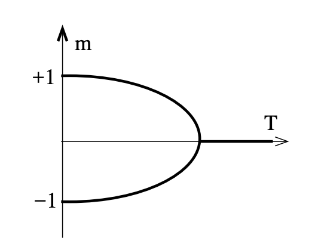

!!! Note 

    These notes are strongly opinionated, following [Jaynes](https://www.amazon.com/Probability-Theory-Science-T-Jaynes/dp/0521592712), and present statistical physics as the application of the [maximum entropy principle](statistics.md) to physical systems. Furthermore, thermodynamics is presented in terms of the geometry of the information manifold, following [Caticha](https://www.arielcaticha.com/my-book-entropic-physics).
    
    This seems like the natural modern approach, since it demystifies entropy, temperature and so on, viewing them as information-theoretic concepts, and not intrinsically physical ones. On this view, statistical physics is not new physics, it is the application of probability theory to old physics.

    However, note that it isn't entirely uncontroversial, and a common criticism is that it makes temperature dependent on the information state of an observer, rather than being a property of the system. I take the view that this is indeed the case, but see Caticha for nuanced discussion.

## Statistical physics

A physical system has some configuration space $C$, and is fully characterized by a function $f: Time \to C$, which is typically specified by a Lagrangian. See the notes on [classical physics](classical.md).

**Statistical** physics examines systems up to incomplete information, using the standard apparatus of Bayesian probability theory. That is, we describe our (incomplete) knowledge of a system by a probability distribution over systems, $p : Dist(Time \to C)$ .

While systems live on one manifold (the microspace), the space of interest to statistical physics (call it the "macrospace") is the manifold of distributions over the original space. Each macrostate is really a whole distribution over microstates. Quantities of interest, like energy, can be viewed as expectations over the distribution.

Often the macrospace is much lower dimensional than the microspace (when we only consider maximum-entropy distributions - see below). This is why statistical physics is so effective.

## Equilibrium statistical physics (thermodynamics)

From our distribution, we can obtain a marginal distribution at a given time $t$, i.e. a distribution over $f(t) : C$. Equilibrium physics is concerned with such marginal distributions $\rho(t) : Dist(C)$ which are time-invariant under the dynamics of the system, i.e.

$$
\frac{\partial}{\partial t}\rho(t) = 0
$$

The principle of maximum entropy orders that we pick the maximum-entropy distribution over states consistent with our assumptions, namely: (1) the distribution is stationary, (2) either the exact energy of the system or the expected energy (if the system is open) has a fixed value, (3) other variables like the volume or the (expected) number of particles are fixed.

The maximum entropy distributions we obtain are typically in the [exponential family](../maths/probability.md), so thermodynamics amounts to the study of the exponential family manifold.

Concretely, suppose we have a classical system with Lagrangian $\mathcal{L}$, and we know the expected energy $\langle E \rangle$, where $E$ is a function on phase space $E(p,q) \in \mathbb{R}$. Then the appropriate distribution is $P(p,q) = \frac{1}{Z}e^{-\beta E(p,q)}$, where $\beta$ is a free parameter

The physics community uses a different terminology, reflecting the complicated history of the field. Here is a table of terminological correspondences between probability and physics:

- partition function $Z$ <-> normalization constant
- Free energy <-> log normalizer of exponential family
- energy $E$ <-> sufficient statistic of the exponential family distribution $P$
- temperature $T := \frac{1}{\beta}$ <-> natural parameter of the exponential family distribution

think:
    relationship between energy befing sufficient stat and stationarity:
        a symmetry argument?

Open system

This gives us a (sub)manifold of exponential family distributions, which we can parametrize either in primal or dual coordinates, related by a Lagrange transform. These are either:
- parametrized by mean energy
- parametrized by temperature

## First law of thermodynamics

heat and work: todo
## Second law of thermodynamics

This is a straightforward consequence of the principle of maximum entropy: the Gibbs entropy $\rho$ remains constant over time, by Louiville's theorem, but the equilibrium distribution is the maximum entropy distribution with the relevant constraint (expected energy), so must have greater or equal entropy to the Gibbs entropy. 

TODO: think through ^

It is only equal when the path from the initial distribution to the final one lies on the maximum entropy submanifold (i.e., the process is quasistatic).

TODO: third law

## Free energy

$F \propto \log Z$. Why is it so important? It is minimized in equilibrium,

TODO: why??

and satisfies $F = \langle H \rangle - TS$, so that at high temperature, it is maximized by maximizing entropy, and at low temperature, by minimizing energy. 

TODO: why minimized?

## Non-equilibrium statistical physics

Here, we want to consider also the evolution of the system towards equilibrium over time, so our belief distributions are over full paths of the system over time.

### Brownian motion

Suppose we have an SDE:

$$
\frac{d}{dt}
\begin{bmatrix}
x \\
v
\end{bmatrix} = \begin{bmatrix}
v \\
\frac{-v}{\tau} + \frac{\xi(t)}{m}
\end{bmatrix}
$$

The first term in the change in velocity is frictional (i.e. proportional to velocity), while the second is a random force $\xi$ drawn from some stationary distribution over functions $\R \to \R$, with $E[\xi](t) = 0$ and $c(t) := E[\xi(0)\xi(t)]$ decays to $0$ at a time scale $\tau_\alpha << \tau$.

!!! Note 

    Looking at dimensions, we see that $\tau$ is a timescale, i.e. has dimensions of time.

We may now ask about if and how this system approaches equilibrium, which mathematically means: what is the time-invariant fixed point of the flow of the marginal probability of $v(t)$.

This gives 

$$
v(t) = v_0e^{-t/\tau}+\frac{1}{m}\int_0^te^{-(t-t')/\tau}\xi(t')dt'
$$

so we see that $E[v](t) = v_0e^{-t/\tau}$ and that 

$$
E(v(t_1)v(t_2)) = v_0^2e^{-t_1/\tau}e^{-t_2/\tau}\\ + \frac{1}{m^2}\int_0^{t_1}dt'e^{-(t-t')/\tau}\int_0^{t_2}dt''e^{-(t_2-t'')/\tau}c(t''-t')
$$

and then using the fast decay of $c(t)$ to evaluate the inner integral, by taking $c$ a positive constant $\int c(s)ds$ only at $t''=t'$, we can obtain:

$$
E(v(t_1)v(t_2)) = (v^2_0 - D/\tau)e^{-(t_1+t_2)/\tau} + \frac{D}{\tau}e^{-(t_2-t_1)/\tau}
$$

for $D := \frac{\tau^2}{2m^2}\int c(s)ds$.

This form reveals several things:

- since at equilibrium the correlation function can only depend on time difference, we see the process equilibrates at large $t$
- but this analysis of the approach to equilibrium also holds if the initial velocity $v_0$ is draw from the equilibrium distribution itself, in which case $t_1$ and $t_2$ can be arbitrarily small. In that case, $v_0^2=D/\tau$.
- by equipartition, we also know that $mv^2_0/2 = k_bT/2$, so $mk_BT/\tau = \int_0^\infty E(\xi(0)\xi(t))dt$. This relates dissipation ($\tau$) and fluctuation ($\xi$).
- the *diffusion constant* D measures the rate of change of variance: it has dimensions $L^2T^{-1}$ accordingly

## Phase transition

Thermodynamic states live on the information manifold, and observables (functions from the manifold to $\R$) can be measured experimentally.

For systems that have a size $N$, when $N$ tends to infinity, we often see non-analytic behavior of observables as we move on the manifold, and the points at which cusps or discontinuities appear are known as phase transitions.

### The Ising Model

This is the physicist's name for a Markov Random Field on a rectangular graph with Bernoulli variables. Solvable in 1D and 2D. It is important because it is a simple model which displays a phase transition.

In the language of physics, each Bernoulli variable is called a spin, and the graph is called a lattice. Spins take values $1$ and $-1$, instead of $0$ and $1$. The partition function is written:

$$
Z(\beta) = \sum_s e^{\beta \sum_{\langle i, j \rangle}s_is_j}
$$

where $\sum \langle i, j \rangle$ ranges over neighbouring spins, and $\sum_s$ ranges over all $2^N$ configurations (where $N$ is the number of variables). 

We can now consider the information manifold, parameterized by $\beta$. For each point on the manifold (i.e. each distribution), we calculate a quantity $E_\beta[m]$, for $m(s)=\frac{1}{N}|\sum_i s_i|$. Note the absolute value. 

For large $\beta$, the distribution is dominated by two states, where all spins are up, and where all spins are down. In either case, we have $m(s)=1$, so that $E_\beta[m]=1$. However, as we increase the temperature, states such as the "chessboard" (alternating up and down spins) gain non-zero probability, and since these have $m(s)=0$, we see $E_\beta[m]$ decrease.

At small $\beta$, all states have the same probability, and there are many more states with $m(s)=0$, so that $E_\beta[m] \to 0$. What is remarkable about the Ising model is that for large $N$, the value of $\beta$ for which $E_\beta[m]=0$ for the first time tends towards a finite value.

This implies a non-analyticity of the function $\beta \mapsto E_\beta[m]$ (it is always a fixed value, $0$, after a certain point $\beta^*$, but $>0$ before, and this is not possible for an analytic function - there's a kink in the graph), and this is the characterizing property of the Ising model phase transition.

$\beta^*$ is known as the critical point. As usual, we define $T:=\frac{1}{\beta}$ as the temperature. Near the critical temperature, we find power law behavior, so for $t := (T-T_c)/T_c$:

$$
C_v := \frac{\partial U}{\partial T} \sim |t|^{-\alpha} \\ \quad \\
m \sim |t|^\beta \quad\quad  (t \to 0^-) \\ \quad \\
\chi := \frac{\partial m}{\partial h} \sim |t|^{-\gamma} \\ \quad \\
$$

for $\alpha, \beta, \gamma$ irrational constants that appear in a wide variety of models said to be in the same *universality class* as the Ising model.

### Mean-field theories

(Mean-field) [variational inference]() on the Ising model works as follows. As normal, we consider the manifold of identical independent distributions on the space (so $q_H(s) = \Pi_iq_H(s_i)$), with $H$ the parameter, so that $q_H(s_i) \propto e^{-\beta Hs_i}$.

We then vary $H$ to maximize the lower bound on $L \leq \log Z$:

$$
L(H) := \sum_x q_H(x)\log\frac{q_H(x)}{\hat{p}(x)}
$$

We now exploit our mean field assumption:

$L(H) = E_{s\sim q_H}[\log q_H] - E_{s\sim q_H}[\log \hat p] = E_{s\sim q_H}[-\beta H \sum_is_i - \log Z_H] - E_{s\sim q_H}[-\beta J \sum_{\langle i,j\rangle}s_is_j] = -\beta H NE[s_1] - \log Z_H + \beta J N\frac{1}{2}zE[s_1]^2$

So that (at the minimum), now exploiting the properties of the derivative of the normalizing constant of the exponential family: $0 = \frac{d}{dH}L(H) = -\beta NE[s_1] -\beta H N\frac{d}{dH}E[s_1] - \frac{1}{Z_H}\frac{d}{dH}Z_H + \beta J NzE[s_1]\frac{d}{dH}E[s_1] = -\beta H N + \beta J NzE[s_1]$ 

$$
\Rightarrow H = JzE_{s\sim q_H}[s_1]
$$

This is sufficient to determine the *effective "mean" field* $H$, by finding a value of $m := E[s_1] = \tanh(\beta H) = \tanh(\beta JzE[s_1])$ that is self-consistent. Physicists often give a confusing justification for this choice of the $H$ to do with eliminating fluctuations, but the above is clearer: we are introducing a simplifying constraint (namely, independence) and choosing the best distribution under those circumstances.

#### Exact solution of 2D Ising model

The fact that there is an exact solution to the 2D Ising model is valuable because it proves that the model exhibits phase transitions, and allows the calculation of critical exponents (against which approximate techniques can be compared). 

Actually understanding the exact solution(s) is also valuable, since it involves fundamental ideas in statistical field theory. 

Let $N$ be the length of a side of the grid.

**The transfer matrix method**

This method is quite algebraic. We begin by expressing the normalization constant (aka partition function) $Z$ as the normalization constant of a *quantum* system, i.e. as $Tr(e^{-\beta H})$ where $A^n = e^{-\beta H}$ is known as the *transfer matrix* (with $n$ the length of the lattice). We then use standard techniques of many-body quantum physics.

To arrive at the desired form, we first consider a lattice of width $N$ and height $1$. We can view a configuration of this lattice as a basis element of a Hilbert space $\bigotimes_i^N \mathbb{C}^2$. Concretely, let $|s\rangle = |s_1\ldots s_n\rangle$ by an eigenvector of $\sigma_3(i) := I_1 \otimes \ldots \otimes I_{i-1} \otimes \sigma_3 \otimes \ldots I$, so that $\sigma_3(i)|s\rangle = s_i|s\rangle$. In other words, the state of the lattice at site $i$ is specified by the eigenvalue of $\sigma_3(i)$.

Then for a function $b(K)$ (to be determined below), define:

$$
V_1 := \frac{e^{\sum_i^N b(K)\sigma_1(i)}}{\cosh^N b(K)} \\
\quad \quad \quad \\
V_3 := e^{\sum_i K\sigma_3(i)\sigma_3(i+1)}
$$

so that we have:

$$
\langle s' | V_1V_3 | s \rangle \\
= \langle s' | V_1| s \rangle e^{\sum_i Ks_is_{i+1}} \\
= \prod_i^N\langle s_i' | \frac{e^{\sigma_1(i)}}{\cosh b(K)}| s_i \rangle e^{\sum_i Ks_is_{i+1}}
$$

$$
= \prod_i\langle s_i' | \frac{\cosh b(K) I + \sinh b(K)\sigma(i)}{\cosh b(K)}| s_i \rangle e^{\sum_i Ks_is_{i+1}}
$$

$$
= \prod_i\langle s_i' | I + \tanh b(K)\sigma(i)| s_i \rangle e^{\sum_i Ks_is_{i+1}}
$$

$$
= (\delta_{s_i, s'_i} + \delta_{s_i, -s'_i}\tanh b(K))e^{\sum_i Ks_is_{i+1}}
$$

so that with $b(K) = \tanh^{-1}(e^{-2K})$, we recover the energy of the Ising model.

!!! Note

    $b$ is an involution, and in fact represents the *Kramers–Wannier* duality : distributions parametrized by $K$ and by $b(K)$ on the manifold are (up to some factors) the same. 

That makes $V_3V_1$ function as a transfer matrix, in the sense that $Tr((V_3V_1)^2) = \sum_s \sum_s' \langle s | V_3V_1 |s'\rangle \langle s' | V_3V_1 | s \rangle$ is a sum over all states of the Ising model for height $3$ and so on for higher $n$.

Note that our partition function is then also a time evolution of a quantum system.

Calculating $Tr(V_3V_1)$ is difficult and requires us to rewrite the Pauli matrices as Majorana fermions (fermions following a Clifford algebra). After this, diagonalization is straightforward.

**Under construction**

## Renormalization

Suppose you have some field, for instance the discrete field $s : \Z \to C$ for some $C$. This is a (1D) lattice with a value at each site. There is a natural projection map $\pi$ which drops the even sites, to obtain a new lattice which can be expressed as a new field $s' : \Z \to C$. It is as if we have zoomed out by a factor of 2.

This projection map $\pi$ induces a map on distributions over configurations of the field, so a map $f : I(M) \to I(M)$, where $I(M)$ is the space of distributions over functions $\Z \to C$.

A key insight is that fixed points of $f$ are critical points of phase transitions. Methods for discrete fields and continuous fields, in real and Fourier space exist.

<!-- The simplest example would be the Central Limit Theorem, where $M$ is $\R$ (for example), and we have the function $\lambda x \mapsto x+x$, which one can think of as a scale transformation where we squash the real line to half its size. The operation on PDFs is $f \mapsto (f * f) / 2$, that is, by the sum (or in fact, the mean) of a distribution with itself, and the fixed point is the Gaussian distribution. Note that this endomorphism can be seen as a scale transformation of discrete random (which are nothing but sums of variables), and so works on absolutely any distribution over a given space. -->

### Real space, discrete (Migdal-Kadanoff)

The simplest example of renormalization is illustrated with the 1D Ising model. Recall that the Ising model (aka Markov Random Field) has the form $p(\bold{s}) = e^{\sum_{\langle i,j\rangle}Ks_is_j}$. Call $I_{MRF}$ the space of distributions on the 1D lattice, parametrized by the choice of $K$, so that $Z(K)$ denotes a particular such distribution.

We are interested in some expectation, e.g. $G(k, K) := \langle x_0x_k\rangle_K$. We then make three key observations:

- marginalization shouldn't affect the result, in the sense that $G(32)$ could be calculate directly, or calculated after marginalizing out the odd sites
- the model we obtain after marginalizing out the odd sites lives on the same manifold $I_{MRF}$ (if we assume the lattice is infinitely large), so is $Z(f(K))$, for some $f$. (Intuitively, the conditional independence structure of the model makes this clear: once we marginalize out sites $1$ and $3$, sites $0$ and $2$ will be dependent, but $0$ and $4$ will be conditionally independent given $2$.)
- this act of marginalization therefore gives us a flow $f$ on the manifold, and it will turn out that the fixed points are the critical points, i.e. where phase transitions happen.

Here are the details. The new model is given by:

$$
\sum_{s_{even}}\sum_{s_1}e^{Ks_1(s_0+s_2)}\sum_{s_3}e^{Ks_3(s_2+s_4)}\ldots
$$

We observe that $\sum_{s_1 \in \{1,-1\}}e^{Ks_1(s_0+s_2)}$ is a function of $s_0$ and $s_2$ which is invariant under $s_0 \mapsto -s_0, \quad s_2 \mapsto -s_2$, and since $s_i^2=1$, we obtain: $\sum_{s_1 \in \{1,-1\}}e^{Ks_1(s_0+s_2)} = e^{f(K)s_0s_2 + C}$

We then get an equation for each choice of values for $s_0$ and $s_2$. In particular:

$$
2\cosh(K(1 + 1)) = e^{f(K) + C}
$$

$$
2\cosh(K(1 - 1)) = e^{-f(K) + C}
$$

These can jointly be solved by $e^{f(K)} = \sqrt{\cosh(2K)}$ and $e^{C}=2\sqrt{\cosh(2K)}$, so $\tanh f(K) = \tanh^2 K$.

As regards $G$, note that then $G(2n, K)= G(n, f(K))$, so that for $G(n, K) = e^{-n/\xi(K)}$, we get:

$$
e^{-2n/\xi(K)} = e^{-n/\xi(f(K))} \Rightarrow \xi(K) = 2\xi(f(K))
$$

This real-space approach to renormalization isn't particularly general; in the 2D Ising model for example, decimation introduces more complex relationships between variables, so the information manifold is no longer 1D, and instead we have terms $K_1s_is_j, K_2s_is_js_ks_l$, and others.

### Real space, continuous

The simplest example of renormalization in real space is to consider the (infinite dimensional) Gaussian distribution, which is a distribution over functions $\phi : \R^d \to \R$:

$$
Z(m) = \int D\phi \quad e^{-S_m(\phi)} \\
S(\phi) = \int \nabla^2\phi(x) + m\phi(x)^2dx
$$

We first note that a change of variables $x' = x/b$ has the following effect:

$$
S(\phi) = \int \nabla^2\phi(x'b) + m\phi(x'/b)^2d(x'/b) \\ = b^{d}\int b^{-d}\nabla^2\phi'(x') + mb^{2-d}\phi'(x')^2dx' 
$$

where $b^{(2-d)/2}\phi'(x/b) = \phi(x)$. Defining $m' = b^{-2}m$, we have:

$$
S_m(\phi) = \int \nabla^2\phi'(x) + m'\phi'(x)^2dx = S_{m'}(\phi')
$$

We then do a change of variable of the *outer* integral $D\phi$, so that $\log Z(m) = \log Z(m') + C$
wait that's wrong!!

**Under construction**
TODO: finish ^

In this case, rather than marginalizing every other site

The standard approach is to write the theory, like Landau did, in terms of a normalization constant $\int e^{-F(\phi)}D\phi$, but where $F$ is an analytic function(al) around $\phi=0$ with all terms ($a_1\phi^n, a_2\nabla^n\phi^m\ldots$). Then the following transformation, known as renormalization, can be seen as a map from the infinite dimensional parameter space of $a_i$ to itself. 

Working in Fourier space, with $\Lambda$ the reciprocal of the minimum grid spacing, $\Lambda' = \Lambda/\zeta$ for some $\zeta \in [1, \infty)$, and $F[\phi] = F_0[\phi^-]+F_0[\phi^+] + F_I[\phi^-,\phi^+]$, where $\phi^\pm$ are the parts of $\phi$ composed of frequencies above/below $\Lambda'$, we define:

$$
% e^{-F'[\phi^-]} := e^{F_0[\phi^-_k]}\int\prod_{\Lambda' < k < \Lambda}d\phi_k^+e^{F_0[\phi^+_k]}e^{F_I[\phi^-_k, \phi^+_k]}
e^{-F'[\phi^-]} := e^{F_0[\phi^-]}\int D\phi^+e^{F_0[\phi^+]}e^{F_I[\phi^-, \phi^+]}
$$

so that

$$Z = \int D\phi^- e^{F_0[\phi^-]}\int D\phi^+e^{F_0[\phi^+]}e^{F_I[\phi^-, \phi^+]} \\ \quad \\
:= \int D\phi^-e^{-F'[\phi^-]}
$$

$F'$ is also analytic, so differs from $F$ by the coefficients $a_i$, however the path integral is over functions whose Fourier components only go up to $\Lambda'$. We therefore rescale by $k \mapsto \zeta k$, so $x \mapsto x/\zeta$, and also rescale so that the $\nabla \phi \cdot \nabla\phi$ term has the same coefficient as in $F$.

This procedure is parametrized by $\zeta \in [1,\infty)$, and each $F$ describes a point on the information manifold over fields, so what we have is a flow on the manifold. Certain fixed points of the flow are critical points.

**Example**

Take $F[\phi] = \frac{1}{2}\int (\nabla_x\phi(x))^2 + m^2\phi(x)^2dx$. Then since the Fourier basis is an eigenbasis of the Laplacian, we get $F_I=0$, and

$$
e^{-F'[\phi^-]} = e^{F_0[\phi^-]}\int D\phi^+e^{F_0[\phi^+]} = \mathcal{N}e^{-F[\phi^-]}
$$

We then rescale, with $x \mapsto x/\zeta$

$$
F'(\phi^-) \propto F_0(\phi^-) = \frac{1}{2}\int (\nabla_x\phi^-(x))^2 + m^2\phi^-(x)^2d^dx \\ \quad \\ 
= \frac{1}{2(2\pi)^d}\int^{\Lambda/\zeta} (k^2 + m^2)\phi_k^-\phi_{-k}^- d^dk \\ \quad \\
\mapsto \frac{1}{2(2\pi)^d}\int^{\Lambda} ((\frac{k}{\zeta})^2 + m^2)\zeta^{2w}\phi_k^-\phi_{-k}^- d^dk' \frac{1}{\zeta^n} \\ \quad \\
$$

so that with $w = \frac{2+n}{2}$, we have

$$
F'(\phi^-) \propto \frac{1}{2(2\pi)^d}\int^{\Lambda} (k^2 + \zeta^2m^2)\phi_k^-\phi_{-k}^- d^dk' \\ \quad \\
$$

which means that renormalization has induced a change of $m^2 \mapsto \zeta^2m^2$, which gives us a fixed point at $\mu^2 = 0$ or $\mu^2=\infty$. The first is the Gaussian fixed point. This is more or less the central limit theorem.

## Landau theory

!!! References

    [David Tong's notes](https://www.damtp.cam.ac.uk/user/tong/sft/one.pdf) are good as usual. Other resources often poorly motivate why the free energy can be viewed as a function of $m$, which is both subtle and necessary to understand.

!!! Note

    It is expedient to use the Ising model as a running example, although Landau theory is a general technique.

The idea is to obtain the bifurcation diagram of a phase transition qualitatively (i.e. topologically correct) without computing the partition function explicitly.

Concretely, what we want to obtain is:

First, a definition: $F(m, T) := -T\log \sum_{s|m}e^{-\frac{1}{T} H(s)}$, where $\sum_{s|m}$ means the sum ranging over all configurations $s$ with $\frac{1}{N}\sum_i s_i = m$.  Then:

$$
Z(T) = \sum_m\sum_{s | m} e^{-\beta H(s)} := \sum_m e^{-\beta F(m, T)} \approx \int dm e^{-\beta F(m, T)}
$$

In the case that the final integral is dominated by the minimum $m^*$, we get $Z(T) \approx e^{-\beta F(m^*, T)}$, so that $F$ is, as suggested by the name, the equilibrium free energy.

Actually calculating $F$ as defined here is usually intractable, but we can still make progress. 

We first observe from the definition above that $F$ has to respect certain symmetries. For the Ising model, $F(m, T)=F(-m, T)$, as seen from the definition and the symmetry of the Hamiltonian. Further, we expect it to be analytic in $m$, at least for a finite sum, so that in an expansion around the minimum (dropping the constant term):

$$
F(m,T)  \approx r_0(T)m^2 + r_1(T)m^4
$$

The key fact is then that **we know $m^*$ must be $0$ above the critical temperature**. 

But observe that the bifurcation diagram of the above polynomial (i.e. plotting the minimum $m^*$ of $F(m, T)$ as a function of $T$) shows two non-zero minima appearing precisely when $r_0(T) \geq 0$. So we can deduce $r_0(T) = a(T-T_c)$, at least close to $T_c$.

TODO: spontaneous symmetry breaking:

$$
m = \lim_{B\to 0} \lim_{N\to \infty} \frac{1}{N}\sum_i \langle s_i \rangle
$$

<!-- 

In the Ising model, position is discrete, and the value at each position is boolean. So the state is a function $m_d : \Z \times Z \to \{-1,1\}$. If we generalize to $m_c : \R \times \R \to \R$, we can use more interesting methods. We can obtain $m_c$ as the average of $m_d$ in a ball around any point.

First write $Z(T) = \int Dm e^{-\frac{1}{T}\int g(m(x))dx} := \int Dm e^{-G(m,T)}$, where $Dm$ indicates an integral over all functions $m$. -->

<!-- Assume the exponent is dominated by constant functions, then in particular the constant function  $\lambda x : m^*$ will dominate, where $m^*$ is the minimum of $g$, so that $Z(T) = e^{-Vf(T)} = e^{-G(m^*)}$, so that $f(T) = G(m^*,T)$. -->

<!-- We now observe that $G$ is analytic (finite sum of exponentials) and even. So, neglecting constant terms, and in the vicinity of $m^*$: -->

Since $m^*$ is minimal: $0 = 2r_0(T)m^* + 4r_1(T)m^{*3} \Rightarrow m^*(T) = \pm \sqrt{\frac{2|r_0(T)|}{4u_0(T)}}$.

## Landau-Ginzburg

We can generalize the above to a field. Let $m : \R\times\R \to \R$, and write as above:

$$
Z(T) = \sum_m\sum_{s | m} e^{-\beta H(s)} := \sum_m e^{-\beta F(m, T)} \approx \int dm e^{-\beta F(m, T)}
$$

However now $m$ is a function, so the final integral ranges over functions.

The simplest case is 

$$
F(m) = \int d^nx (\nabla m)^2(x) + \mu^2m^2(x)
$$

For which $p(m)\propto e^{-F(m)}$ is a (infinite dimensional) Gaussian. At and above criticality, we observe that for all $x$, the marginal distribution $m(x)$ must be $0$, so at $T=T_c$, $\mu=0$. 
<!-- Note that if $F$ were interpreted as the Lagrangian of a QFT, excitations would be massless. -->

TODO: explain: helmholtz?

### Magnetic field and chemical potential

There is a relationship between magnetic fields and chemical potentials.

For example, $H(n) = -J\sum_{\langle i,j \rangle}n_in_j$ would be a reasonable Hamiltonian for a lattice gas with no double occupation. If we assume that particles and energy can be exchanged with the bath (grand canonical ensemble) so that only mean energy and particle number is known, our distribution is:

$$
p(n) \propto e^{-\beta(J\sum_{\langle i,j \rangle}n_in_j + \mu \sum_in_i)}
$$

But with the Ising model, we instead have $H(s) = -J\sum_{\langle i,j \rangle}s_is_j - B\sum_is_i$. Only energy is exchanged (nothing moves), so our distribution is:

$$
p(s) \propto e^{-\beta (J\sum_{\langle i,j \rangle}s_is_j + B\sum_is_i)}
$$

This is the same distribution, with a different interpretation. It suggests that to model a sort of thing with fixed number in a field (e.g. spins) is the same as modeling things with no fixed number without a field. 

### Critical exponents

For a function $f$, we write 

$$
f(x) \sim x^\alpha
$$

to mean 

$$
\alpha = \lim_{x\to 0} \frac{\log|f(x)|}{\log|x|}
$$

These are the conventions:

$$
c \sim t^{-\alpha}
$$

$$
m \sim t^{\beta} \sim B^{\frac{1}{\delta}}
$$

$$
\chi \sim t^{-\gamma}
$$

$$
\xi \sim t^{-\nu}
$$

# notes

$$
F[(T)\phi] = \int d^dx \frac{1}{2}\alpha_2(T)\phi^2 + \frac{1}{4}\alpha_4(T)\phi^4 + \frac{1}{2}\gamma(T)(\nabla\phi)^2
$$

First consider $\alpha_4=0$. Then when $\alpha_2 > 0$, taking functional derivative and solving the Helmholtz equation gives 

Define $\xi^2 = \gamma/\mu^2$. From this, we can calculate the normal facts like $\langle \phi(x)\phi(0)\rangle \sim \frac{e^{-r/\xi}}{r^{(d-1)/2}}$ in the $r >> \xi$ regime. Further, since $\mu^2 \sim t$, we have $\xi \sim t^{-\nu}=t^{-\frac{1}{2}}$

## Linear Response Theory

The following assumes the basics of statistical mechanics (see notes). Suppose we have a system whose Hamiltonian is $H$ and we perturb it to $H\_T = H - K(t)A(p,q)$. We then want to calculate the resulting change in expectation $\Delta B(t) = E\_{H\_T}[B(t)] - E\_{H}[B(t)]$.

Ostensibly, this would require knowing the (time varying) distribution of the system resulting from the perturbation, but we can get what we want by exploiting the a quite general form of the fluctuation-dissipation theorem. The critical assumption is that this applies in the limit of $K$ small:

$$ \Delta B(t) = \beta E\_H[\dot{A}(0)B(t)] * K(t) $$

This is sort of amazing: the expected perturbation is the output of a linear system with input $K$ and a kernel representing the correlation of the change of input variable and the output variable, under the original system. So you can predict the response to a small perturbation of the system just by seeing the behavior of the system without the perturbation.

## Spontaneous symmetry breaking

todo

non-commuting limits

To say that the Ising model has a spontaneously broken symmetry is to say that in the limit

$$
\lim_{b\to 0}\lim_{N \to \infty} m(b,N, T=0) \neq 0
$$

That is, in the limit of an infinitely large system ($N \to \infty$) and $0$ temperature, an arbitrarily small magnetic field $b$ will make the system choose either the all-spins-up or the all-spins-down state.

More generally, spontaneous symmetry breaking involves a system with a symmetry of the Hamiltonian that exhibits this kind of arbitrary sensitivity to perturbation.